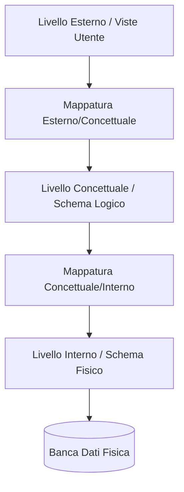

# 🏛️ Architettura dei Sistemi DBMS

L'**Architettura di un DBMS (Database Management System)** definisce l'organizzazione interna e i livelli di astrazione necessari per garantire l'efficienza, l'affidabilità, l'indipendenza dei dati e il corretto accesso concorrente all'interno di un sistema informativo aziendale.

---

## 1. L'Architettura a Tre Livelli (Three-Schema Architecture)

Proposta originariamente dal comitato ANSI/SPARC, l'architettura a tre livelli suddivide la descrizione del database in tre schemi separati al fine di isolare le applicazioni utente dai dettagli della memorizzazione fisica dei dati.

### 1. Livello Esterno o di Vista (External Level)
Descrive la parte del database che interessa a uno specifico utente o gruppo di utenti, nascondendo il resto. Ciascun gruppo ha la propria **vista (view)** personalizzata.
*   *Esempio:* Un impiegato dell'ufficio risorse umane vede gli stipendi ma non i dati medici; un medico dell'azienda vede le cartelle cliniche ma non i salari.

### 2. Livello Concettuale (Conceptual Level)
Descrive la struttura dell'intero database per una comunità di utenti. Nasconde i dettagli fisici di memorizzazione e si concentra sulla descrizione di **entità, attributi, relazioni e vincoli**. Viene espresso tramite un modello logico (es. Relazionale) partendo da un modello concettuale (es. ER).
*   *Esempio:* Le tabelle `Impiegati`, `Dipartimenti`, `Progetti` e le chiavi esterne che le collegano.

### 3. Livello Interno (Internal Level)
Descrive la struttura di memorizzazione fisica del database. Si occupa di allocazione dei file su disco, indici di ricerca (es. B-Tree), compressione e percorsi di accesso fisici.
*   *Esempio:* La definizione di record a lunghezza fissa o variabile, e la creazione di indici sulla colonna `ID_Impiegato`.

---

## 2. Indipendenza dei Dati (Data Independence)

La separazione in tre livelli consente di ottenere l'**indipendenza dei dati**, ossia la capacità di modificare lo schema a un livello senza dover modificare gli schemi dei livelli superiori o i programmi applicativi.

### A. Indipendenza Logica dei Dati (Logical Data Independence)
È la capacità di modificare lo schema concettuale senza dover modificare gli schemi esterni o i programmi applicativi. 
*   *Esempio:* Se aggiungiamo una nuova tabella o un nuovo attributo allo schema concettuale, le viste esterne preesistenti continuano a funzionare intatte.

### B. Indipendenza Fisica dei Dati (Physical Data Independence)
È la capacità di modificare lo schema interno senza dover modificare lo schema concettuale o quelli esterni.
*   *Esempio:* Se decidiamo di organizzare i file sul disco in modo diverso, o creiamo un nuovo indice di ricerca per velocizzare le query, lo schema delle tabelle (concettuale) e le query degli utenti rimangono invariati.

---

## 3. Attori sul Sistema DBMS

La gestione e l'utilizzo del DBMS coinvolgono diverse figure professionali:
*   **Database Administrator (DBA):** Responsabile del controllo complessivo del sistema, dell'installazione del DBMS, della sicurezza, del backup e del monitoraggio delle prestazioni fisiche.
*   **Database Designer:** Progetta lo schema del database (concettuale e logico), identificando i dati da memorizzare, le relazioni e i vincoli.
*   **Sviluppatori Software:** Scrivono le applicazioni che interagiscono con il database (es. query embedded in linguaggi di programmazione).
*   **Utenti Finali (End Users):** Coloro che inseriscono, modificano o interrogano i dati tramite interfacce preconfezionate o query dirette (es. manager, impiegati).

---

## Fonti
* [[wiki/Fonti/Fonte_Elmasri_Cap2_Database_Concepts.md]]
