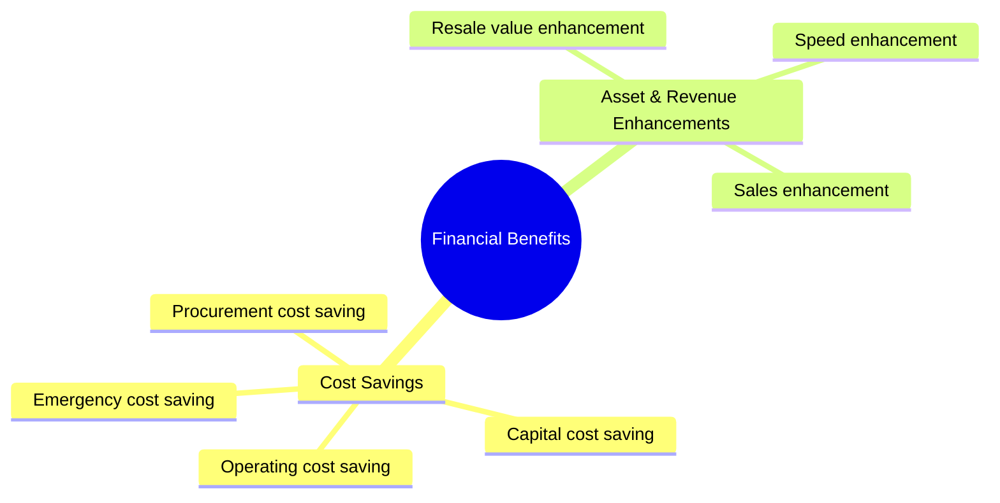

# Classification of Financial Benefits (Jensen 2013)

In technical B2B sales, quantifying the monetary value of a solution is essential to justify high capital expenditures (CAPEX). According to the framework by **Jensen (2013)**, taught by **Prof. Dr. Thomas Berger** (Slide 24), customer benefits can be systematically categorized into seven financial impact areas.

---

## 📊 The 7 Financial Benefit Categories

### 1. Procurement Cost Saving
Savings related to the acquisition phase of products or services:
*   **Examples**: Reducing supplier evaluation costs, automating/simplifying documentation and compliance costs, and optimizing freight or logistics costs.

### 2. Resale Value Enhancement
Increasing the residual value of assets at the end of their lifecycle:
*   **Examples**: High-quality machinery or vehicles that command a premium in the second-hand market (secondary market value).

### 3. Operating Cost Saving (OPEX Reduction)
Direct reduction in day-to-day running costs of the operations:
*   **Examples**: Minimizing raw material costs, lowering energy consumption, reducing direct/indirect labor costs, and lowering waste disposal costs.

### 4. Capital Cost Saving
Optimizing working capital and inventory holding costs:
*   **Examples**: Reducing warehouse storage space/costs, and decreasing interest/financing costs by shortening inventory cycles.

### 5. Emergency Cost Saving (Risk Mitigation)
Reducing the probability or cost of negative events:
*   **Examples**: Lowering product liability costs, and preventing expensive production line downtime or shutdowns.

### 6. Speed Enhancement
Increasing throughput and operational efficiency:
*   **Examples**: Enabling the processing of more orders in the same amount of time, and shortening machinery setup times and associated costs.

### 7. Sales Enhancement (Top-Line Growth)
Helping the client increase their own sales or charge higher prices to their end-customers:
*   **Examples**: Boosting sales via co-branding or component branding (e.g., "Intel Inside"), and enabling a higher price point due to the improved quality of the supplied component.

---

## Fonti
*   *Jensen: "Financial benefit calculation as a basic competence in technical sales", Sales Management Review, Issue 9/10, 2013, pp. 38-47.*
*   *Sales Competences course slides (Slide 24) - Prof. Dr. Thomas Berger.*
*   *[[Slide_Sales_Competences_Thomas_Berger]]*
