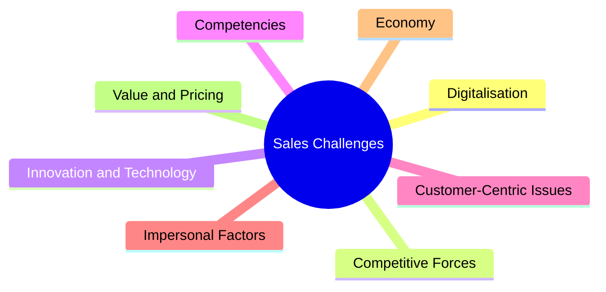

# Current Challenges in Sales (Multinational Study)

This note covers the **Current Challenges in Sales**, based on the landmark multinational study co-authored by **Prof. Dr. Thomas Berger** (DHBW Lörrach) and published in the *International Journal of Technology Marketing* (2025/2026).

---

## 📊 Study Metadata
*   **Authors**: Thomas Berger, Timo Holopainen, Pentti Korpela, and Poul von Wowern.
*   **Scope**: Survey of **1,247 salespersons and sales managers** across **21 countries** (including Germany, USA, Belgium, Italy, Austria, France, Finland, Netherlands, Poland, Sweden, Denmark, Great Britain, Ireland, Hungary, and Romania).
*   **Objective**: To establish a comprehensive, global perspective on the contemporary challenges faced by sales organizations.

---

## 🔑 Key General Findings
1.  **Digitalisation** is the most frequently mentioned challenge across all countries.
2.  **Changing Competitive Forces** is the second most common challenge.
3.  **Demographic Independence**: The concerns expressed by sales professionals are independent of their work experience, education level, or management tier.
4.  **Country Differences**: While challenges are globally shared, their intensity and specific manifestation vary by country, requiring tailored sales management strategies.

---

## 🛠️ The 8 Clusters of Sales Challenges

The study categorizes the challenges into eight distinct groups:

### 1. Digitalisation (#1 Challenge)
The rapid integration of digital technologies in the sales process:
*   Implementing and utilizing CRMs, virtual selling tools, and AI.
*   Adapting to data-driven sales workflows and virtual customer communication.

### 2. Competitive Forces (#2 Challenge)
The shifting nature of market competition:
*   Increased pressure from global competitors and new market entrants.
*   Intense price competition and commoditization of products.

### 3. Innovation and Technology
Adapting to rapid changes in product lifecycles and technical complexity:
*   The necessity to constantly learn and sell new technical solutions.
*   Managing technological innovation pace.

### 4. Competencies
The gap in critical skills and capabilities within sales teams:
*   Finding, hiring, and retaining sales engineers and technical sales talent.
*   Up-skilling existing sales teams to match complex technical requirements.

### 5. Customer-Centric Issues
Changing expectations and buying habits:
*   Dealing with highly informed B2B buyers who conduct research before contacting sales.
*   Aligning products with custom, complex requirements.

### 6. Impersonal Factors
Structural barriers outside direct control:
*   Regulatory frameworks, compliance standards, environmental laws, and geographical barriers.

### 7. Economy
Macroeconomic headwinds:
*   Inflation, fluctuations in purchasing power, recessions, and global supply chain disruptions.

### 8. Value / Pricing
Communicating and defending price:
*   Shift from selling features to selling ROI / value.
*   Negotiating price margins with sophisticated procurement departments.

---

## Fonti
*   *Berger T., Holopainen T., Korpela P., von Wowern P. (2025). "Challenges in sales: a multinational study". International Journal of Technology Marketing, Vol. 19, No. 4, pp. 387–402.*
*   *Sales Competences course slides (Slide 15) - Prof. Dr. Thomas Berger.*
