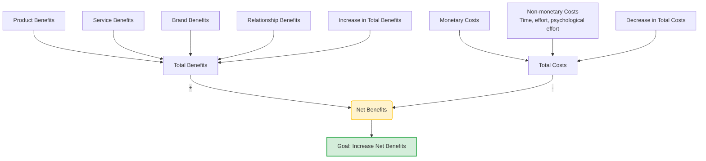

# Different Kinds of Utility (Customer Value Model)

The concept of **Utility** (or Customer Value) is central to complex B2B selling and technical sales. Rather than just comparing raw product specifications, B2B sales organizations must understand and maximize the **Net Benefits** delivered to the client, as modeled by **Vogel (2006)** and taught by **Prof. Dr. Thomas Berger** (Slide 23).

---

## 📊 The Net Benefits Framework

The framework divides utility into two core dimensions: **Total Benefits** and **Total Costs**. The ultimate strategic goal of a sales process is to **Increase Net Benefits** by simultaneously driving up benefits and driving down costs.

---

## 🔑 Key Components of the Model

### 1. The Benefit Dimension (Total Benefits)
B2B customer utility is built upon four categories of benefits:
*   **Product Benefits**: The core functional value, technical performance, reliability, and quality of the physical product or technology.
*   **Service Benefits**: The quality of installation, training, customer support, maintenance, and technical consulting. In B2B sales engineering, service is often as critical as the product itself.
*   **Brand Benefits**: The reputation, trust, and risk reduction associated with purchasing from a well-known, established brand (e.g., "Nobody gets fired for buying IBM").
*   **Relationship Benefits**: The trust, ease of communication, long-term partnership, and personal rapport built between the sales engineer and the customer's buying center.

### 2. The Cost Dimension (Total Costs)
Costs are not limited to the purchase price on the invoice:
*   **Monetary Costs**: The direct purchase price, licensing fees, maintenance fees, and operational costs.
*   **Non-monetary Costs**:
    *   **Time and Effort**: Time required to research, evaluate, implement, integrate, and learn the new system.
    *   **Psychological Effort**: The risk of failure, internal resistance to change within the client's organization, and the stress of transitioning to a new vendor.

---

## 🎯 Sales Implications: Selling Value over Price

In complex technical sales, successful **Challenger Sellers** do not compete by lowering prices (which damages margins). Instead, they:
1.  **Enhance Relationship & Service Benefits**: Acting as consultative problem solvers to increase the client's perceived Total Benefits.
2.  **Mitigate Non-monetary Costs**: Offering seamless integration, extensive training, and risk-mitigation guarantees to reduce the customer's psychological effort and time investment.
3.  **Quantify ROI**: Converting abstract benefits (like reliability or brand trust) into measurable financial gains, ensuring the **Net Benefits** are clearly positive.

---

## Fonti
*   *Vogel: Customer Loyalty and Customer Value, Wiesbaden 2006, p. 32.*
*   *Sales Competences course slides (Slide 23) - Prof. Dr. Thomas Berger.*
*   *[[Slide_Sales_Competences_Thomas_Berger]]*
