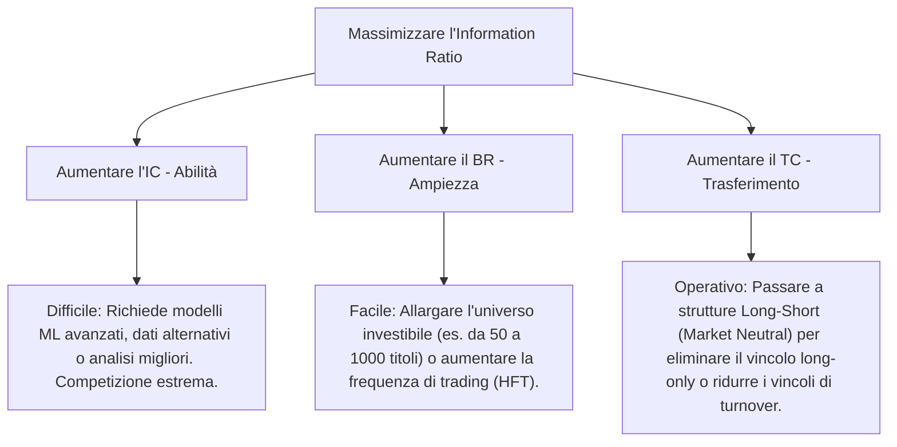

# 📐 Legge Fondamentale dell'Active Management

La **Legge Fondamentale dell'Active Management** (formalizzata da Richard Grinold e Ronald Kahn) è il pilastro matematico su cui poggia l'intera industria della finanza quantitativa (*Quantitative Finance*). Essa stabilisce una relazione quantitativa diretta tra l'abilità di previsione di un gestore ($IC$), il numero di decisioni indipendenti effettuate ($BR$) e la performance finale corretta per il rischio del portafoglio ($IR$).

---

## 1. La Legge Fondamentale (Formulazione Base)

La formulazione classica assume che il gestore possa implementare le proprie idee sul mercato **senza alcun vincolo** (assenza di vincoli di short-selling, liquidità, leva o turnover). In questo scenario ideale, l'Information Ratio atteso è definito come:

$$IR = IC \cdot \sqrt{BR}$$

Dove:
- **$IR$ (Information Ratio)**: La metrica di performance attiva corretta per il rischio ($IR = \alpha / \omega$).
- **$IC$ (Information Coefficient)**: La misura dell'abilità pura di previsione del gestore. È definita come la correlazione tra i rendimenti attivi previsti (*forecasts*) e i rendimenti effettivi realizzati (*realized returns*):
  $$IC = \text{Corr}(\alpha_{\text{forecast}}, R_{\text{residual}})$$
- **$BR$ (Breadth / Ampiezza)**: Il numero di decisioni di investimento **indipendenti** che il gestore o il modello effettua nel corso di un anno.

---

## 2. La Legge Fondamentale Estesa (Con Vincoli di Portafoglio)

Nella realtà operativa, i gestori istituzionali devono rispettare numerosi vincoli imposti dai regolamenti o dai clienti (es. vincolo Long-Only, limiti di leva, limiti di concentrazione settoriale). Questi vincoli impediscono al gestore di assumere le posizioni ideali imposte dai propri segnali predittivi.

Per modellare questa inefficienza costruttiva, Clarke, de Silva e Thorley (2002) hanno esteso la legge introducendo il **Transfer Coefficient (TC)**:

$$IR = TC \cdot IC \cdot \sqrt{BR}$$

Dove:
- **$TC$ (Transfer Coefficient / Coefficiente di Trasferimento)**: Misura l'efficienza con cui il gestore traduce le sue previsioni grezze in pesi reali di portafoglio. È definito come la correlazione tra i pesi attivi ideali ($w_{\text{active, ideal}}$) e i pesi attivi reali implementati ($w_{\text{active, real}}$):
  $$TC = \text{Corr}(w_{\text{active, ideal}}, w_{\text{active, real}})$$

### Implicazioni del TC:
- **$TC = 1.0$**: Portafoglio privo di vincoli (es. hedge fund con possibilità illimitata di short-selling e leva).
- **$TC < 1.0$**: Portafoglio vincolato. Tipicamente, in un fondo comune di tipo *Long-Only*, il $TC$ crolla a valori compresi tra **0.30 e 0.50** poiché non è possibile andare corti sui titoli sopravvalutati, provocando una massiccia perdita di valore informativo (*Information Loss*).

---

## 3. Analisi dei Componenti Chiave

### A. Information Coefficient ($IC$): L'abilità Pura
L'IC quantifica la qualità scientifica dei segnali algoritmici. Un IC pari a $1.0$ indicherebbe una previsione perfetta del futuro, mentre un IC pari a $0.0$ indica pura casualità.
- **Livelli Empirici**: Nella realtà quantitativa dei mercati azionari liquidi, un $IC$ annuo compreso tra **0.05 e 0.10** è considerato eccezionale ed è sufficiente per generare profitti straordinari se combinato con un Breadth adeguato.

### B. Breadth ($BR$): L'Ampiezza Strategica
Il Breadth non rappresenta semplicemente il numero di azioni in portafoglio, ma il numero di scommesse **statisticamente indipendenti** effettuate ogni anno.
- Se un gestore investe in 100 azioni del settore tecnologico altamente correlate tra loro, il $BR$ effettivo non è 100, ma è molto più vicino a 1, poiché i titoli si muoveranno all'unisono guidati dallo stesso fattore di rischio.
- **Espansione del BR**:
  $$BR = \frac{N \cdot M}{1 + (N-1)\rho}$$
  dove $N$ è il numero di attività, $M$ è la frequenza annuale di ribilanciamento e $\rho$ è la correlazione media tra le decisioni. All'aumentare della correlazione $\rho$, il $BR$ effettivo si riduce drasticamente.

---

## 4. Applicazione Speculativa: Come Massimizzare il Rendimento Attivo?

Un gestore quantitativo che punta a massimizzare l'[[Information_Ratio_IR]] per ottenere performance eccellenti ha tre leve a disposizione:

1. **Aumentare l'IC (Abilità)**: È la strada più complessa e costosa. Richiede la scoperta di nuovi fattori alfa non correlati al mercato, l'uso di machine learning e l'acquisizione di dati alternativi proprietari.
2. **Aumentare il BR (Ampiezza)**: È la via preferita dai fondi quantitativi sistematici. Invece di concentrarsi su pochi titoli con un IC elevato, preferiscono fare migliaia di piccole scommesse indipendenti su un universo enorme di titoli (es. 2000 azioni del Russell 3000 ribilanciate giornalmente o settimanalmente).
3. **Aumentare il TC (Trasferimento)**: Consiste nel negoziare la rimozione dei vincoli operativi. Questo spiega perché le strutture di tipo **Hedge Fund** (che utilizzano vendita allo scoperto, leva e derivati) riescono storicamente a generare Information Ratio superiori rispetto ai fondi tradizionali mutualistici, a parità di abilità predittiva ($IC$).

---

## Fonti
* [[wiki/Fonti/Fonte_Grinold_Kahn_APM.md]]
* [[wiki/Fonti/Fonte_Chincarini_QEPM.md]]
* [[wiki/Concetti/Information_Ratio_IR.md]]
* [[wiki/Concetti/Market_Efficiency_and_Financial_Intermediaries.md]]
