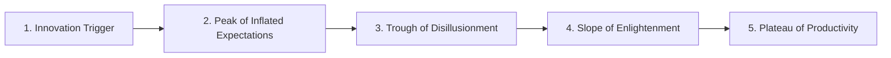

# Gartner Hype Cycle for Sales Technologies (2024)

This note covers the **Gartner Hype Cycle for Sales Technologies (2024)**, based on Slide 16 of the *Sales Competences* course by **Prof. Dr. Thomas Berger** (UNIVPM / DHBW Lörrach).

---

## 📈 Structure of the Gartner Hype Cycle
The Gartner Hype Cycle represents the maturity, adoption, and business application of technologies through five distinct phases:

---

## 🔴 Highlighted Technologies (Circled in Red on the Slide)

Prof. Dr. Thomas Berger highlighted four key technologies of contemporary interest in B2B sales management:

### 1. AR and VR for Sales (Augmented & Virtual Reality)
*   **Hype Cycle Phase**: **Innovation Trigger** (Early development/adoption).
*   **Time to Plateau**: 5–10 years.
*   **Concept**: Using immersive technologies to showcase complex physical products (like heavy machinery, factory layouts, or medical equipment) to B2B buyers without shipping physical prototypes. Allows joint development and virtual prototyping.

### 2. Generative AI for Sales
*   **Hype Cycle Phase**: **Trough of Disillusionment** (Entering the valley where initial hype cools down and real implementation challenges emerge).
*   **Time to Plateau**: 2–5 years.
*   **Concept**: Using Large Language Models (LLMs) to automate and personalize email campaigns, write sales pitches, generate sales collateral, or summarize customer meetings. B2B companies are currently facing challenges such as hallucinations, lack of brand voice consistency, and high output volume leading to spam filters.

### 3. Sales AI Assistants
*   **Hype Cycle Phase**: **Trough of Disillusionment** (Struggling with integration, user adoption, and data accuracy).
*   **Time to Plateau**: 2–5 years.
*   **Concept**: AI-powered copilots that assist sales reps with daily tasks, such as automatically updating CRM records, scheduling meetings, drafting replies, and recommending next best actions.

### 4. Revenue Intelligence
*   **Hype Cycle Phase**: **Slope of Enlightenment** (Moving towards productive and mature business usage).
*   **Time to Plateau**: 2–5 years.
*   **Concept**: Software that automatically captures and analyzes B2B customer interactions (emails, video calls, phone records) using NLP and machine learning (e.g., tools like Gong or Chorus). It provides sales managers with objective pipeline visibility, conversational analytics (e.g., talking vs. listening ratio), and more accurate revenue forecasting.

---

## 🗺️ Mapping of Other Key Sales Technologies (2024)

### Innovation Trigger (Trigger di Innovazione)
*   **Machine Sellers**: Autonomous agents negotiating simple, low-value transactional sales.
*   **Digital Twin of a Customer**: Virtual simulations of customer behavior to test sales strategies.
*   **Digital Sales Rooms (DSR)**: Secure shared portals where B2B buyers and sellers collaborate and share documents during long sales cycles.
*   **RevOps Data Automation**: Automating data sharing between marketing, sales, and customer success.

### Peak of Inflated Expectations (Picco delle Aspettative)
*   **Emotion AI**: Detecting customer sentiment/emotions during sales calls.
*   **Natural Language Query**: Querying CRM databases using normal speech or text.

### Trough of Disillusionment (Fase di Disillusione)
*   **Revenue Enablement Platforms**: Systems designed to manage training, content, and tools for sales reps.
*   **Digital Adoption Platforms (DAP)**: Tools that guide sales reps on how to use complex enterprise software (e.g., Salesforce).

### Slope of Enlightenment (Salita di Apprendimento)
*   **Account-Based Marketing (ABM) Platforms**: Targeting highly specific high-value accounts with custom marketing.
*   **Customer Success Management Platforms**: Software tracking post-sale usage and customer health metrics.

---

## Fonti
*   *Sales Competences course slides (Slide 16) - Prof. Dr. Thomas Berger (DHBW).*
*   *Gartner Hype Cycle for Sales Technologies Research (2024).*
