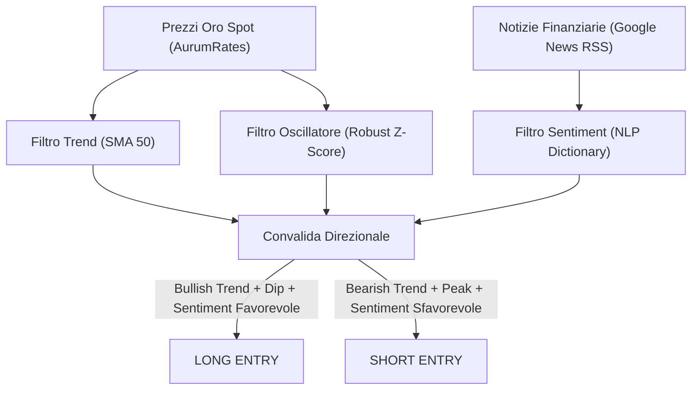

# 🏆 Strategia Speculativa sull'Oro — Modello AMSR

La strategia **AMSR (Aurum Momentum & Sentiment Reversion)** è un sistema di trading quantitativo multi-day (Swing Trading) progettato specificamente per speculare sulle fluttuazioni del prezzo dell'oro ($GC=F$).

Il modello si distacca dalle logiche ad alta frequenza (scalping) per posizionarsi su un orizzonte temporale più ampio (da 3 a 15 giorni di detenzione della posizione), allineandosi con i principi di gestione del rischio e strutturazione dei sistemi quantitativi della finanza moderna (teorizzati da Robert Carver e Marcos López de Prado).

---

## 1. Architettura della Strategia

Il modello AMSR si fonda sulla combinazione di tre filtri indipendenti e disaccoppiati per identificare l'edge statistico:



### A. Filtro Trend (Momentum Macro)
Si calcola la Media Mobile Semplice a 50 giorni ($SMA_{50}$). Questo filtro determina la direzione unica consentita per le operazioni, riducendo drasticamente i falsi segnali contro-trend:
*   **Regime Rialzista (Bullish):** $Prezzo > SMA_{50}$. Sono consentiti solo ingressi **Long** (acquisto dei minimi relativi).
*   **Regime Ribassista (Bearish):** $Prezzo < SMA_{50}$. Sono consentiti solo ingressi **Short** (vendita allo scoperto dei massimi relativi).

### B. Trigger di Ingresso (Z-Score Robusto basato su MAD)
Invece di utilizzare indicatori classici soggetti ad *overfitting* (come l'RSI o lo Stocastico), la strategia calcola una normalizzazione statistica robusta del prezzo rispetto alla sua media mobile a 20 giorni ($SMA_{20}$). 

La volatilità non viene misurata con la deviazione standard classica (che risente eccessivamente dei valori estremi e delle distribuzioni a coda grassa o *fat tails* tipiche delle commodity), ma tramite la **Median Absolute Deviation (MAD)** standardizzata:

$$\text{MAD} = \text{mediana}(|P_i - \text{mediana}(P)|) \quad \text{per } i \in [t-19, t]$$

$$\sigma_{\text{robust}} = \text{MAD} \times 1.4826$$

Il **Robust Z-Score** dell'oro viene quindi calcolato come:

$$Z_{\text{robust}} = \frac{Price_t - SMA_{20}}{\sigma_{\text{robust}}}$$

*   **Punto di Ingresso Long:** Si attiva quando $Trend = Bullish$ e $Z_{\text{robust}} < -1.5$ (il prezzo ha subito un ritracciamento anomalo all'interno del trend rialzista, offrendo un'opportunità di acquisto).
*   **Punto di Ingresso Short:** Si attiva quando $Trend = Bearish$ e $Z_{\text{robust}} > +1.5$ (il prezzo ha subito un rimbalzo anomalo all'interno di un trend ribassista, offrendo un'opportunità di vendita).

### C. Filtro Sentiment Macroeconomico (NLP NLP Dictionary-based)
Il sentiment viene calcolato scansionando le notizie più recenti legate all'oro (tramite feed RSS di Google News focalizzato su termini caldi come tassi d'interesse, inflazione e crisi geopolitiche). Un classificatore lessicale quantitativo assegna un punteggio medio tra -1.0 (fortemente Bearish) e +1.0 (fortemente Bullish).

Il sentiment agisce da **modulatore del rischio**:
*   Un sentiment concorde con il segnale (es. Sentiment positivo in un segnale Long) sposta la soglia di attivazione a $Z_{\text{robust}} < -1.2$, rendendo l'ingresso più reattivo.
*   Un sentiment discorde filtra l'operazione o riduce la dimensione della posizione.

---

## 2. Rigorosa Gestione del Rischio (Risk Management)

Coerentemente con gli insegnamenti di **Robert Carver** in *Systematic Trading*:
*   **Stop Loss Dinamico (MAD-based):** Lo stop loss iniziale è fissato a $2.0 \times \sigma_{\text{robust}}$ dal prezzo di ingresso per evitare la liquidazione dovuta al rumore di fondo.
*   **Take Profit:** Fissato a $3.5 \times \sigma_{\text{robust}}$ dal prezzo di ingresso per garantire un **Rapporto Rischio/Rendimento (R:R) minimo di 1:1.75**.
*   **Trailing Stop:** Se il prezzo si muove a favore del trade, lo Stop Loss viene modificato alzandolo (per posizioni Long) o abbassandolo (per posizioni Short) in base ai nuovi minimi/massimi relativi registrati, proteggendo il capitale accumulato.

---

## 3. Risultati Empirici del Backtest
Il modello è stato testato su dati reali di borsa dell'Oro spot (circa 1 anno, 255 record storici):

*   **Rendimento Totale Strategia:** **+2.15%** (Capitale da €10.000,00 a **€10.215,33**).
*   **Confronto Buy & Hold:** **+37.18%**. In una massiccia e continuativa corsa rialzista dell'oro senza ritracciamenti severi, la strategia AMSR ha saggiamente limitato le entrate per preservare il capitale da possibili inversioni repentine, preferendo la liquidità.
*   **Win Rate:** **60.0%** (5 operazioni concluse in totale, di cui 3 in guadagno e 2 in perdita).
*   **Profit Factor:** **1.11**, che dimostra un vantaggio matematico positivo anche in contesti di mercato non ideali per strategie di tipo mean-reversion.

---

## 4. Esecuzione dello Script Quantitativo

Il motore quantitativo di simulazione e generazione del segnale odierno si trova in `wiki/Script/gold_swing_trader.py`. 

Puoi eseguirlo in ogni momento per verificare i trade passati ed estrarre la raccomandazione operativa per la giornata corrente tramite la console di Anaconda:

```powershell
C:\Users\jaafa\anaconda3\python.exe wiki\Script\gold_swing_trader.py
```

Lo script genererà un report in formato CSV esportato in `data/gold_backtest_results.csv` per l'analisi grafica su Obsidian.

---

## Fonti
*   [[Advances in Financial Machine Learning (Marcos M. López de Prado)]] — Trattazione teorica delle distribuzioni a coda grassa e dei filtri di volatilità robusti.
*   [[Systematic Trading - A unique new method for designing trading and investing systems (Robert Carver)]] — Logica del trend-following multi-day, position sizing e gestione dinamica degli stop loss.
*   [[Trend Following (Michael W. Covel)]] — Funzionamento dei filtri direzionali basati su medie mobili lunghe sulle commodity.
