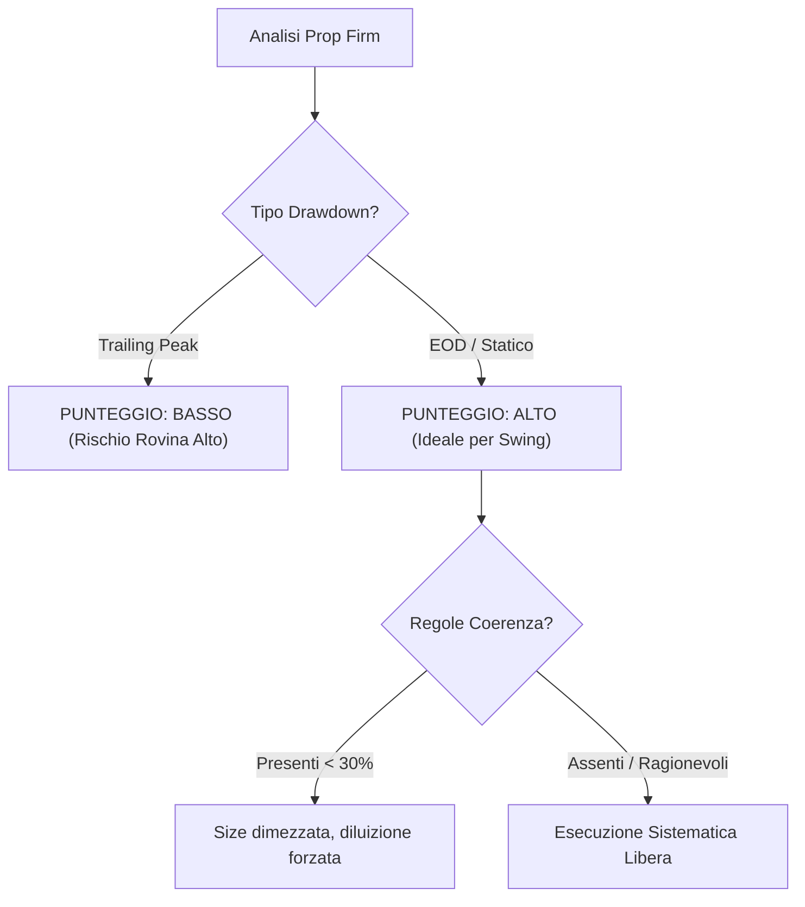

# 🏆 Prop Firm Quantitative Selection — La Guida Definitiva

Nel trading sistematico moderno, la scelta della **Prop Firm** non è una decisione commerciale o di marketing, ma un'analisi puramente **quantitativa ed algoritmica**. I parametri e i regolamenti delle Prop Firm sono vincoli di programmazione rigidi che definiscono il tuo spazio operativo e condizionano direttamente l'edge statistico di una strategia.

Questa guida analizza matematicamente le strutture delle Prop Firm, svelando le asimmetrie nascoste a sfavore del trader e impostando una checklist rigorosa per selezionare il miglior partner di capitale.

---

## 1. La Trappola Suprema: Trailing Drawdown vs. Balance-Based Drawdown

La regola del **Drawdown Massimo** (*Max Drawdown*) definisce la massima perdita cumulativa consentita sul conto prima della liquidazione. Le Prop utilizzano due metodologie di calcolo opposte. La differenza tra di esse determina se una strategia swing a lungo termine può sopravvivere o è destinata a fallire matematicamente.

### A. Trailing Drawdown (Drawdown Dinamico sul Picco)
Il Trailing Drawdown insegue in tempo reale il **punto di massimo profitto** (*Peak Equity* o *Peak Balance*) registrato dal conto, comprese le plusvalenze latenti aperte (*open equity*).

#### Il Meccanismo Matematico:
Ipotizziamo un conto da **$100.000** con un Max Drawdown di **$5.000** (soglia di rovina iniziale a $95.000):

$$\text{Soglia di Rovina}_t = \max(\text{Soglia di Rovina}_{t-1}, \text{Peak Equity}_t - \$5.000)$$

1. **Trade 1 (in guadagno aperto):** La tua posizione va a favore del trade. L'equity tocca un picco non realizzato di **$104.000**. La soglia di rovina viene immediatamente trascinata verso l'alto a **$99.000** ($104.000 - $5.000).
2. **Ritracciamento:** Il trade ritraccia e decidi di chiuderlo in profitto a **$101.000**. La soglia di rovina **rimane bloccata a $99.000** (non scende mai).
3. **Il Risultato Asimmetrico:** Sebbene il tuo conto sia in profitto reale di $1.000 ($101.000), il tuo buffer di perdita effettivo si è ridotto da $5.000 a soli **$2.000** ($101.000 - $99.000)!

```text
 Equity ($)
   ▲         * Picco Equity: $104k (Soglia di Rovina sale a $99k)
   │        / \
   │       /   * Chiusura Trade: $101k
   │      /     \
   │     /       \   ◄── Buffer rimasto: solo $2k!
 99┼ - - - - - - -*───────────────────────── (Soglia di Rovina bloccata)
   │   /
 95┼ -* (Soglia di Rovina Iniziale)
   └────────────────────────────────────────► Tempo (t)
```

> [!CAUTION]
> Il Trailing Drawdown dinamico punisce sistematicamente le strategie di **Trend Following** e **Swing Trading** che lasciano respirare i profitti. Sotto questa regola, far crescere il conto aumenta la probabilità di rovina. È un'asimmetria statistica progettata per far fallire i trader che seguono regole professionali di reinvestimento.

### B. Balance-Based / Static Drawdown (Drawdown sul Saldo Chiuso)
La soglia di rovina si aggiorna solo a **fine giornata** (basandosi sul saldo reale chiuso a mercato) o rimane completamente **statica** sul saldo iniziale del conto.

*   **Balance-Based (End of Day - EOD):** Se il tuo conto tocca $104.000 di picco ma chiude la giornata a $101.000, la nuova soglia di rovina per il giorno successivo sarà calcolata a $96.000 ($101.000 - $5.000). Il tuo buffer rimane costante a **$5.000**.
*   **Static Drawdown (Statico):** La soglia di rovina rimane fissa a $95.000 per tutta la durata del conto (o fino al raggiungimento di un profitto che la azzera al saldo di partenza).

> [!TIP]
> **Scelta Quantitativa:** Per una strategia a lungo termine, seleziona **esclusivamente** Prop Firm che offrono **Static Drawdown** o **EOD (End of Day) Drawdown**. Se costretto a operare con un Trailing Drawdown, devi tagliare la tua *Position Size* del **50-60%** rispetto a quanto calcolato dai modelli standard per compensare la contrazione geometrica del buffer.

---

## 2. La Regola di Coerenza (Consistency Rule) e i Limiti Operativi

Molte Prop che offrono superamenti apparentemente facili impongono vincoli stringenti per evitare payout consistenti. Le principali da monitorare sono:

### A. La Regola del Giorno Singolo (Single Day Profit Cap)
Stabilisce che nessun singolo giorno di trading può rappresentare più di una determinata percentuale (es. **30%** o **40%**) del profitto totale cumulato al momento della richiesta di prelievo.

$$\text{Massimo Profitto Giornaliero} \le \text{Profitto Totale} \times \text{Cap Percentuale}$$

*   **L'impatto:** Se fai un trade eccezionale che genera il 50% del tuo profitto mensile, non potrai prelevare finché non farai altri trade (spesso inutili o rischiosi) per "diluire" la percentuale di quel giorno fortunato.
*   *Valutazione:* Questa regola penalizza le strategie basate su rari eventi ad alto rendimento (es. trading di news o momentum esplosivo).

### B. Coerenza della Size (Consistency Size Rule)
Richiede che la dimensione dei tuoi trade (in lotti o contratti) rimanga all'interno di un range medio prestabilito (es. deviazione massima del 100% dalla size media).

*   *L'impatto:* Impedisce di fare *position sizing dinamico* basato sulla volatilità come suggerito da Robert Carver. Se la volatilità dell'oro si dimezza, la matematica imporrebbe di raddoppiare la size del contratto per mantenere lo stesso rischio monetario; questa regola te lo vieta.

---

## 3. Futures (NinjaTrader/Rithmic) vs. Forex/CFD (MT5)

La scelta del mercato sottostante determina l'infrastruttura tecnologica e la trasparenza dei prezzi.

| Parametro | Futures (es. Apex, Topstep) | Forex / CFD (es. FTMO, 5%ers) |
| :--- | :--- | :--- |
| **Sottostante** | Contratti Regolamentati (CME, CBOT) | Contratti Over-The-Counter (OTC) |
| **Piattaforma** | NinjaTrader 8, Tradovate, Sierra Chart | MetaTrader 5, cTrader |
| **Trasparenza Prezzi** | **Assoluta** (Order Book centralizzato) | **Variabile** (Spread definiti dal broker della prop) |
| **Drawdown Tipico** | Spesso Trailing (attenzione!) | Quasi sempre EOD o Static (ottimo) |
| **Esecuzione Automatica** | Eccellente via C# o Bridge locale | Molto semplice via API Python/MT5 |
| **Costi Ricorrenti** | Canone mensile dati di mercato (~$12/mese) | Nessuno |

---

## 4. Checklist Quantitativa per la Scelta della Prop

Prima di acquistare una *Challenge*, assegna un punteggio di conformità a ciascun parametro:



1.  **[ ] Il drawdown è calcolato a fine giornata (EOD) o è statico?** (Fattore eliminatorio: se Trailing, scartare o ridurre drasticamente la size).
2.  **[ ] C'è un limite di tempo per superare la challenge?** (Le migliori prop oggi offrono tempo illimitato, eliminando l'ansia del trading forzato).
3.  **[ ] Esistono regole di consistenza sul profitto giornaliero o sulla size?** (Preferire prop senza "Single Day Cap" per proteggere i trade ad alto rendimento del modello AMSR).
4.  **[ ] Qual è la leva reale consentita sull'asset specifico?** (Verificare se la leva cambia durante le notizie macro economiche).
5.  **[ ] Il broker associato applica commissioni e spread onesti?** (Spread ampi erodono il profitto nei trade multi-day mean-reversion).

---

## Fonti
*   **Robert Carver** — *[[Systematic Trading - A unique new method for designing trading and investing systems (Robert Carver)]]* (Gestione dinamica del rischio e drawdown dei portafogli).
*   **Robert Carver** — *[[raw/input.md]]* (Leveraged Trading: Chapter 2 - Choosing your broker, and Appendix B - Costs and execution).
