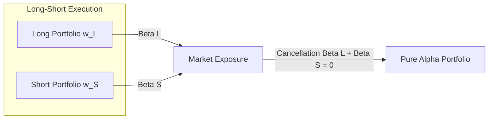

# ⚖️ Market Neutral Portfolios

I **Portafogli Market Neutral** (portafogli neutrali al mercato) sono strategie di investimento quantitative progettate per eliminare completamente l'esposizione al rischio sistematico del mercato (Beta) e ad altri fattori macroeconomici o di stile. L'obiettivo primario di queste strategie, storicamente fondate nel 1949 da Alfred Winslow Jones, è quello di isolare l'**Alpha puro** (le abilità di stock picking del modello) estraendo rendimenti positivi sia in contesti di mercato rialzisti che ribassisti.

---

## 1. Dollar Neutrality vs. Beta Neutrality

L'annullamento del rischio sistematico può essere implementato a diversi livelli di rigore scientifico. È fondamentale distinguere tra la neutralità monetaria e la neutralità al rischio finanziario.

### A. Dollar Neutrality (Neutralità Monetaria)
Un portafoglio è monetariamente neutrale quando il valore monetario complessivo delle posizioni lunghe (Long) è esattamente pari al valore monetario delle posizioni corte (Short). In termini di pesi di portafoglio:

$$\sum_{i \in \text{Long}} w_i = 100\% \quad \text{e} \quad \sum_{i \in \text{Short}} w_i = -100\% \implies \sum_{i=1}^N w_i = 0$$

> [!WARNING]
> La *Dollar Neutrality* non garantisce in alcun modo l'assenza di rischio di mercato. Se i titoli in posizione Long hanno una sensibilità media al mercato (Beta) molto superiore ai titoli Short (es. Long su tecnologici ad alto beta e Short su utility a basso beta), il portafoglio risulterà comunque rialzista ed esposto a crolli del mercato.

### B. Beta Neutrality (Neutralità al Rischio Sistematico)
Un portafoglio è *Beta-Neutral* quando la sua sensibilità complessiva alle fluttuazioni dell'indice di mercato è matematicamente nulla:

$$\beta_p = \sum_{i=1}^N w_i \beta_i = 0$$

Per raggiungere questo obiettivo, l'ottimizzatore quantitativo deve imporre che la somma pesata dei Beta dei singoli titoli (stimati tramite regressione sui dati storici) sia uguale a zero.

### C. Risk-Factor Neutrality (Neutralità Multi-Fattoriale)
Nelle gestioni quantitative evolute (QEPM), la neutralità viene estesa a tutti i fattori di stile sistematici (es. Size, Value, Growth, Momentum, Liquidity) e ai settori industriali. Sia $\mathbf{B}$ la matrice delle esposizioni dei titoli ai $K$ fattori ($N \times K$); la neutralità fattoriale si esprime come:

$$\mathbf{B}^T \mathbf{w} = \mathbf{0}$$

---

## 2. Il "Mojo" del Market Neutral: L'Effetto Leva e il Double Alpha

Assumendo che i rendimenti azionari siano guidati da un modello multifattoriale lineare:
$$r_i = \alpha_i + \sum_{k=1}^K \beta_{i, k} f_k + \epsilon_i$$

Se il portafoglio rispetta perfettamente il vincolo di neutralità fattoriale $\sum_i w_i \beta_{i, k} = 0$, tutti i premi dei fattori sistematici $f_k$ si azzerano. Il rendimento del portafoglio market-neutral diventa:

$$R_{MN} = \sum_{i=1}^N w_i r_i = \sum_{i=1}^N w_i \alpha_i + \sum_{i=1}^N w_i \epsilon_i = \alpha_{MN} + \epsilon_{MN}$$

### L'Effetto "2 Alpha Mojo"
Si assuma che il gestore quantitativo costruisca un portafoglio market-neutral bilanciato, in cui le posizioni lunghe generano in media un alfa positivo $\alpha_L = \alpha$ e le posizioni corte (selezionando titoli destinati a sottoperformare) generano in media $\alpha_S = -\alpha$. 
Investendo interamente il capitale sia sul lato Long ($100\%$) che sul lato Short ($-100\%$), l'alfa del portafoglio market-neutral risulta raddoppiato:

$$\alpha_{MN} = \mathbf{w}_L^T \boldsymbol{\alpha}_L - \mathbf{w}_S^T \boldsymbol{\alpha}_S = \alpha - (-\alpha) = 2\alpha$$

Questo incremento di rendimento atteso è dovuto puramente alla leva finanziaria implicita nella strategia ($200\%$ di esposizione lorda totale).

### Analisi della Varianza e dell'Information Ratio
Calcoliamo la varianza del portafoglio market-neutral:
$$\sigma_{MN}^2 = \text{Var}(\epsilon_L - \epsilon_S) = \text{Var}(\epsilon_L) + \text{Var}(\epsilon_S) - 2\text{Cov}(\epsilon_L, \epsilon_S)$$

Ipotizzando varianze dei residui Long e Short identiche e pari a $\omega^2$:
$$\sigma_{MN}^2 = 2\omega^2(1 - \rho)$$
dove $\rho$ è il coefficiente di correlazione tra i rendimenti residuali delle posizioni Long e Short.

L'Information Ratio ($IR$) del portafoglio market-neutral è:

$$IR_{MN} = \frac{2\alpha}{\sqrt{2\omega^2(1 - \rho)}} = \sqrt{\frac{2}{1 - \rho}} \cdot \frac{\alpha}{\omega} = \sqrt{\frac{2}{1 - \rho}} \cdot IR_{LO}$$

> [!IMPORTANT]
> Poiché la correlazione residuale $\rho$ è solitamente molto inferiore a $1$ (e idealmente vicina a zero o negativa se le selezioni sono indipendenti), il fattore $\sqrt{\frac{2}{1-\rho}}$ è strettamente superiore a $1$. Ciò significa che **la strategia market-neutral offre sistematicamente un Information Ratio superiore rispetto a una strategia Long-Only**.

---

## 3. Aspetti Meccanici e Struttura dei Costi

Le strategie market-neutral presentano complessità operative notevoli e costi che possono erodere i margini di profitto se non modellizzati correttamente:

1. **Leva Finanziaria (Leverage)**:
   Per generare rendimenti significativi a fronte di una volatilità ridotta, le strategie market-neutral operano spesso con rapporti di leva importanti (es. $2\text{x}$ a $4\text{x}$, con $200\%$ Long / $200\%$ Short).
2. **Margine di Garanzia (Margin Accounts)**:
   Le vendite allo scoperto richiedono il deposito di un collaterale (solitamente contante o titoli di stato) presso il *Prime Broker*. Questo capitale subisce vincoli di liquidità ed è esposto a possibili *margin call* in caso di movimenti avversi.
3. **Costi del Prestito Titoli (Shorting Costs)**:
   Per vendere allo scoperto un'azione, il gestore deve prenderla in prestito pagando una fee al broker (Borrow Fee). Titoli illiquidi o fortemente speculati (*hard-to-borrow*) presentano commissioni molto elevate, capaci di azzerare l'alfa atteso. Inoltre, esiste il rischio sistematico di **Short Squeeze**, in cui il rialzo violento di un titolo costringe i venditori allo scoperto a ricoprirsi, spingendo il prezzo ulteriormente verso l'alto.

---

## 4. Estensioni: Portable Alpha e Pair Trading

### A. Portable Alpha (Trasporto dell'Alpha)
La neutralità al mercato permette di "trasportare" l'alfa generato su qualsiasi benchmark di mercato. Poiché il portafoglio market-neutral ha $\beta = 0$, esso può essere combinato con derivati a basso costo (es. contratti futures su indice S&P 500) per ottenere un rendimento pari a:

$$R_{\text{total}} = R_{\text{S&P 500}} + \alpha_{MN}$$

In questo modo, l'investitore beneficia del rendimento del mercato di riferimento più l'alfa puro generato dall'algoritmo di stock picking quantitativo, senza alcuna sovrapposizione di rischio Beta.

### B. Pair Trading (Trading di Coppia)
Rappresenta la versione microscopica della strategia market-neutral applicata a soli due titoli fortemente correlati (es. Coca-Cola vs. PepsiCo). Il modello analizza lo scostamento temporaneo dello spread di prezzo dalla sua media storica di lungo periodo (processo stazionario a media autocorretta o *co-integrazione*):
- Si acquista il titolo sottovalutato (Long).
- Si vende allo scoperto il titolo sopravvalutato (Short).

---

## Fonti
* [[wiki/Fonti/Fonte_Chincarini_QEPM.md]] (Chapter 13 & Appendix 9B)
* [[wiki/Fonti/Fonte_Grinold_Kahn_APM.md]] (Chapter 14)
* [[wiki/Concetti/Information_Ratio_IR.md]]
* [[wiki/Concetti/Portfolio_Weights_Optimization.md]]
