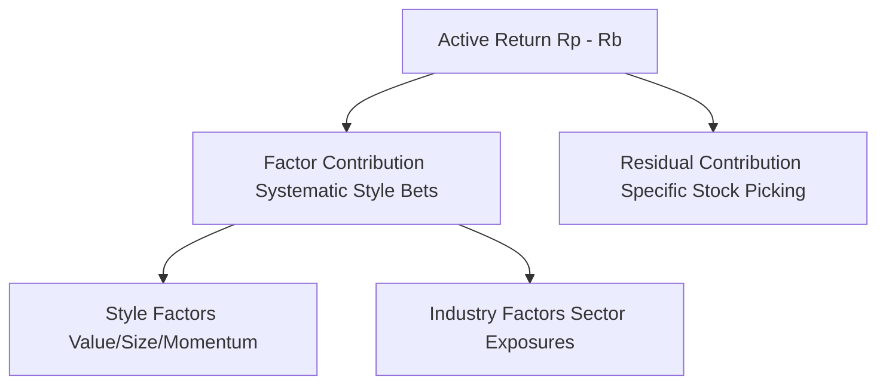

# 📊 Performance Attribution Active

L'**Attribuzione delle Performance Attive** (Active Performance Attribution) è il processo analitico ex-post volto a dissezionare il rendimento realizzato di un portafoglio finanziario rispetto a un benchmark di riferimento. Questo processo permette di identificare con precisione scientifica le fonti e le determinanti della sovrapperformance (Active Return o Alpha) o della sottoperformance, consentendo di distinguere l'impatto delle scommesse sistematiche di stile (Beta dei fattori), delle scelte settoriali (Sector Allocation) e delle capacità di selezione dei singoli titoli (Stock Picking).

---

## 1. Il Modello di Attribuzione Classico (Brinson-Hood-Beebower, BHB)

Il modello di Brinson, Hood e Beebower (1986) rappresenta lo standard dell'industria per l'attribuzione delle performance nei portafogli azionari. Esso suddivide il rendimento attivo ($R_p - R_b$) in due contributi fondamentali: l'effetto di allocazione settoriale e l'effetto di selezione dei titoli.

### Variabili e Definizioni
Si divida l'universo dei titoli in $M$ settori industriali. Per ciascun settore $j \in \{1, \dots, M\}$ definiamo:
- $w_{P, j}$: il peso del settore $j$ nel portafoglio.
- $w_{B, j}$: il peso del settore $j$ nel benchmark.
- $R_{P, j}$: il rendimento realizzato del settore $j$ nel portafoglio, calcolato come rendimento pesato dei titoli che lo compongono:
  $$R_{P, j} = \sum_{i \in S_j} \frac{w_{P, i}}{w_{P, j}} R_i$$
- $R_{B, j}$: il rendimento realizzato del settore $j$ nel benchmark:
  $$R_{B, j} = \sum_{i \in S_j} \frac{w_{B, i}}{w_{B, j}} R_i$$
- $R_p$: il rendimento totale di portafoglio ($\sum_j w_{P, j} R_{P, j}$).
- $R_b$: il rendimento totale del benchmark ($\sum_j w_{B, j} R_{B, j}$).

### I due Effetti della Decomposizione BHB

1. **Effetto Allocazione (Allocation Effect - AE)**:
   Misura il valore aggiunto derivante dal sovra- o sotto-ponderare i vari settori rispetto al benchmark, ipotizzando che all'interno di ogni settore il portafoglio abbia ottenuto lo stesso rendimento dell'indice (rendimento neutrale):
   
$$AE = \sum_{j=1}^M (w_{P, j} - w_{B, j}) R_{B, j}$$

2. **Effetto Selezione dei Titoli (Security Selection Effect - SSE)**:
   Misura l'alfa generato dalla selezione di specifici titoli vincenti all'interno di ciascun settore, ponderato per il peso che il settore ha all'interno del portafoglio:
   
$$SSE = \sum_{j=1}^M w_{P, j} (R_{P, j} - R_{B, j})$$

### Identità di Chiusura BHB
Sommando matematicamente i due effetti, si riottiene esattamente il rendimento attivo totale del portafoglio:

$$AE + SSE = \sum_j (w_{P, j} R_{B, j} - w_{B, j} R_{B, j}) + \sum_j (w_{P, j} R_{P, j} - w_{P, j} R_{B, j}) = R_p - R_b$$

---

## 2. Il Modello di Attribuzione a Tre Fattori (Brinson-Fachler, BF)

Il modello BHB presenta un limite intuitivo: l'effetto di allocazione settoriale premia un gestore per aver sovra-ponderato un settore con rendimento positivo ($R_{B, j} > 0$), anche se tale settore ha performato molto peggio rispetto alla media del benchmark totale ($R_{B, j} < R_b$).

Il modello di **Brinson e Fachler (1985)** corregge questa distorsione misurando le performance dei settori in modo relativo rispetto al benchmark complessivo, e introduce un terzo termine, l'**Effetto Interazione (IE)**, per isolare la combinazione congiunta di allocazione e selezione:

| Effetto | Formula Matematica | Descrizione Economica |
|---|---|---|
| **Allocazione BF** | $$AE_{BF} = \sum_j (w_{P, j} - w_{B, j})(R_{B, j} - R_b)$$ | Valuta se il gestore ha sovra-ponderato settori che hanno sovraperformato la media globale del benchmark ($R_b$). |
| **Selezione BF** | $$SE_{BF} = \sum_j w_{B, j} (R_{P, j} - R_{B, j})$$ | Valuta l'abilità di stock-picking ponderandola esclusivamente per i pesi passivi del benchmark. |
| **Interazione BF** | $$IE_{BF} = \sum_j (w_{P, j} - w_{B, j})(R_{P, j} - R_{B, j})$$ | Cattura l'effetto congiunto derivante dal sovra-ponderare settori in cui lo stock picking è stato particolarmente vincente. |

La somma dei tre effetti Brinson-Fachler ricostruisce anch'essa esattamente il rendimento attivo:
$$R_p - R_b = AE_{BF} + SE_{BF} + IE_{BF}$$

---

## 3. Attribuzione Multi-Fattoriale (Modello Quantitativo)

Per i gestori quantitativi che ottimizzano il portafoglio sulla base di fattori di stile sistematici e non basandosi su settori industriali discreti, Chincarini definisce la **Multifactor Performance Attribution** basata sul modello a fattori del rischio ex-post.

Si consideri un modello lineare a fattori in cui il rendimento attivo campionario del periodo $t$ è scomposto come:

$$R_{p, t} - R_{b, t} = \sum_{k=1}^K (B_{p, k} - B_{b, k}) f_{k, t} + \sum_{i=1}^N (w_{p, i} - w_{b, i}) \epsilon_{i, t}$$

Dove:
- $B_{p, k} = \sum_i w_{P, i} \beta_{i, k}$: Esposizione complessiva del portafoglio al fattore $k$.
- $B_{b, k} = \sum_i w_{B, i} \beta_{i, k}$: Esposizione complessiva del benchmark al fattore $k$.
- $(B_{p, k} - B_{b, k})$: **Active Exposure** (esposizione attiva) al fattore $k$.
- $f_{k, t}$: Il **Factor Premium** (premio del fattore) realizzato nel periodo $t$, stimato econometricamente (tramite stima OLS o MAD robusta cross-sectional).
- $\epsilon_{i, t}$: Rendimento residuale ex-post del titolo $i$ nel periodo $t$ (la componente non spiegata dal modello).

### Scomposizione Quantitativa del Rendimento Attivo
1. **Contributo dei Fattori Sistematici (Factor Contribution)**:
   Rappresenta la quota di sovrapperformance spiegata dalle scommesse sistematiche su fattori di stile e macro:
   
$$\text{Factor Contribution}_k = (B_{p, k} - B_{b, k}) f_{k, t}$$

2. **Contributo della Selezione Specifica (Residual Contribution)**:
   Rappresenta il vero valore aggiunto dello stock picking specifico, depurato dalle esposizioni sistematiche:
   
$$\text{Residual Contribution} = \sum_{i=1}^N (w_{p, i} - w_{b, i}) \epsilon_{i, t}$$

---

## 4. Significatività Statistica dell'Alpha

Per determinare se la sovrapperformance realizzata sia dovuta a una reale abilità predittiva dell'algoritmo (*alpha mojo*) o alla pura casualità, il gestore deve calcolare la **t-statistica di significatività** del rendimento attivo medio registrato in un orizzonte di $T$ periodi (es. mesi):

$$t = \frac{\overline{R}_p - \overline{R}_b}{\text{StDev}(R_p - R_b) / \sqrt{T}} = IR_{\text{ex-post}} \cdot \sqrt{T}$$

### Interpretazione della Significatività
- **$t > 1.96$ (Significativo al $95\%$)**: Indica che la probabilità che l'alfa sia dovuto puramente al caso è inferiore al $5\%$. Il modello ha un reale vantaggio predittivo.
- **$t < 1.00$ (Non Significativo)**: La sovrapperformance rientra nella variabilità casuale del mercato. Il modello necessita di ricalibrazione o presenta problemi di *underfitting*.

---

## Fonti
* [[wiki/Fonti/Fonte_Chincarini_QEPM.md]] (Chapter 15 & Chapter 17)
* [[wiki/Fonti/Fonte_Grinold_Kahn_APM.md]] (Chapter 17)
* [[wiki/Concetti/Information_Ratio_IR.md]]
* [[wiki/Concetti/Fundamental_Factor_Models_Advanced.md]]
