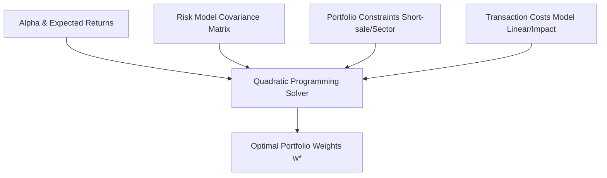

# ⚙️ Portfolio Weights Optimization

L'**Ottimizzazione dei Pesi del Portafoglio** (Portfolio Weights Optimization) è la fase del processo quantitativo in cui le previsioni di rendimento (Alpha o Expected Returns) e il modello di rischio (Varianza-Covarianza) vengono combinati matematicamente per determinare le allocazioni ottimali delle attività finanziarie. Questa fase mira a massimizzare l'utilità del portafoglio corretta per il rischio, rispettando al contempo vincoli reali di operatività e minimizzando l'impatto dei costi di transazione.

---

## 1. La Formulazione Mean-Variance Classica (Markowitz)

Il modello classico di ottimizzazione a media-varianza di Harry Markowitz cerca di trovare il portafoglio che minimizza il rischio per un dato livello di rendimento atteso, oppure massimizza il rendimento per un dato livello di rischio.

### Problema di Massimizzazione dell'Utilità
Nelle gestioni quantitative professionali, l'obiettivo è massimizzare una funzione di utilità quadratica del tipo:

$$\max_{\mathbf{w}} \left( \mathbf{w}^T \boldsymbol{\mu} - \lambda \mathbf{w}^T \mathbf{\Sigma} \mathbf{w} \right)$$

Soggetto al vincolo di bilancio (fully invested):
$$\mathbf{w}^T \boldsymbol{\iota} = 1$$

Dove:
- $\mathbf{w}$ è il vettore dei pesi delle attività nel portafoglio ($N \times 1$).
- $\boldsymbol{\mu}$ è il vettore dei rendimenti attesi ($N \times 1$).
- $\mathbf{\Sigma}$ è la matrice di varianza-covarianza dei rendimenti storici o modellizzati ($N \times N$).
- $\lambda$ è il coefficiente di avversione al rischio del portafoglio (Risk Aversion Parameter).
- $\boldsymbol{\iota}$ è un vettore colonna di $1$ ($N \times 1$).

---

## 2. Formulazione in Programmazione Quadratica (Quadratic Programming)

Poiché l'utilità di portafoglio contiene un termine quadratico (la varianza $\mathbf{w}^T \mathbf{\Sigma} \mathbf{w}$) e vincoli lineari, il problema viene risolto algoritmicamente tramite **Programmazione Quadratica (QP)**.

La forma standard di un problema di programmazione quadratica con vincoli di uguaglianza e disuguaglianza è:

$$\min_{\mathbf{x}} \left( \frac{1}{2} \mathbf{x}^T \mathbf{Q} \mathbf{x} - \mathbf{c}^T \mathbf{x} \right)$$

Soggetto a:
$$\mathbf{A}_{eq} \mathbf{x} = \mathbf{b}_{eq}$$
$$\mathbf{A}_{ineq} \mathbf{x} \le \mathbf{b}_{ineq}$$

### Mappatura delle Variabili Finanziarie nel Solutore QP
Per mappare il problema di utilità di portafoglio nella forma QP standard di minimizzazione:
- $\mathbf{x} \rightarrow \mathbf{w}$ (pesi di portafoglio da ottimizzare).
- $\mathbf{Q} \rightarrow 2 \lambda \mathbf{\Sigma}$ (la matrice simmetrica definita positiva del rischio, scalata per l'avversione al rischio).
- $\mathbf{c} \rightarrow \boldsymbol{\mu}$ (i rendimenti attesi che vogliamo massimizzare, che diventano un termine di minimizzazione con segno invertito).

### Soluzione in Forma Chiusa (Solo Vincoli di Uguaglianza)
Se disponiamo solo del vincolo di bilancio $\mathbf{w}^T \boldsymbol{\iota} = 1$ e di un rendimento target $\mathbf{w}^T \boldsymbol{\mu} = \mu_P$, il problema può essere risolto analiticamente tramite il **Metodo dei Moltiplicatori di Lagrange**. La Lagrangiana è:

$$\mathcal{L}(\mathbf{w}, \lambda_1, \lambda_2) = \frac{1}{2} \mathbf{w}^T \mathbf{\Sigma} \mathbf{w} - \lambda_1 (\mathbf{w}^T \boldsymbol{\iota} - 1) - \lambda_2 (\mathbf{w}^T \boldsymbol{\mu} - \mu_P)$$

Derivando rispetto a $\mathbf{w}$ e imponendo le condizioni del primo ordine (FOC), si ottiene la soluzione analitica per i pesi ottimali:

$$\mathbf{w}^* = \mathbf{\Sigma}^{-1} \left( \lambda_1 \boldsymbol{\iota} + \lambda_2 \boldsymbol{\mu} \right)$$

> [!TIP]
> Questa formula dimostra che i portafogli efficienti sono combinazioni lineari di due portafogli fondamentali: il portafoglio a varianza minima globale ($\mathbf{\Sigma}^{-1}\boldsymbol{\iota}$) e il portafoglio a massima diversificazione corretto per il rendimento ($\mathbf{\Sigma}^{-1}\boldsymbol{\mu}$).

---

## 3. Minimizzazione del Tracking Error e Ghost Benchmarks

Quando un gestore quantitativo non investe in modo assoluto, ma cerca di sovraperformare un indice di riferimento (Benchmark), l'ottimizzazione si sposta sulla minimizzazione della varianza attiva o del **Tracking Error (TE)**.

### Formulazione dell'Active Risk Minimization
Sia $\mathbf{w}_b$ il vettore dei pesi del benchmark e $\mathbf{w}$ il vettore dei pesi del portafoglio. Definiamo il vettore dei pesi attivi come $\mathbf{w}_a = \mathbf{w} - \mathbf{w}_b$. La varianza attiva (Active Variance) è data da:

$$\sigma_a^2 = \mathbf{w}_a^T \mathbf{\Sigma} \mathbf{w}_a = (\mathbf{w} - \mathbf{w}_b)^T \mathbf{\Sigma} (\mathbf{w} - \mathbf{w}_b)$$

Il problema di massimizzazione del rendimento attivo (Active Return $\alpha_P = \mathbf{w}_a^T \boldsymbol{\alpha}$) corretto per l'Active Risk diventa:

$$\max_{\mathbf{w}} \left( (\mathbf{w} - \mathbf{w}_b)^T \boldsymbol{\alpha} - \lambda_a (\mathbf{w} - \mathbf{w}_b)^T \mathbf{\Sigma} (\mathbf{w} - \mathbf{w}_b) \right)$$

### Ghost Benchmarks
Un **Ghost Benchmark** (o Benchmark Fantasma) è un benchmark sintetico e non osservabile direttamente sul mercato, costruito combinando l'indice di riferimento ufficiale con esposizioni a fattori di rischio desiderati (es. Value, Size, Momentum). 
I gestori quantitativi minimizzano il tracking error rispetto a questo benchmark fantasma per assicurarsi che il portafoglio replichi perfettamente lo stile d'investimento desiderato, lasciando la deviazione attiva solo a stock selection specifiche ad alto alpha.

---

## 4. Vincoli Reali di Portafoglio

Nelle applicazioni professionali, il solutore QP deve gestire vincoli operativi complessi che impediscono l'adozione di soluzioni teoriche estreme:

1. **Vincolo di Short-Sale (Long-Only)**:
   $$w_i \ge 0 \quad \forall i$$
   Questo vincolo di disuguaglianza trasforma il problema da una semplice derivazione lagrangiana a una ricerca numerica complessa risolta tramite algoritmi di tipo *Active Set* o *Interior Point*.
2. **Vincoli di Settore o Fattoriali**:
   Per evitare una concentrazione eccessiva su un singolo settore economico o su un fattore sistematico:
   $$L_j \le \sum_{i \in S_j} w_i \le U_j$$
   Dove $S_j$ rappresenta l'insieme dei titoli nel settore $j$, e $L_j, U_j$ sono rispettivamente i limiti inferiori ed superiori (es. $\pm 2\%$ rispetto al peso del benchmark).
3. **Vincoli di Liquidità e Turnover**:
   Limitano la quantità massima di azioni acquistabili o vendibili basandosi sul volume medio giornaliero di scambi ($ADV$):
   $$|w_i - w_{i, 0}| \cdot \text{AUM} \le k \cdot ADV_i$$

---

## 5. Modellizzazione dei Costi di Transazione

Ignorare i costi di transazione in fase di ottimizzazione è uno dei principali motivi di fallimento dei modelli di backtesting quando passano alla produzione reale. I costi di transazione distruggono l'alfa teorico.

### A. Costi di Transazione Lineari
Includono commissioni di intermediazione fisse, tasse sulle transazioni finanziarie e lo spread bid-ask fisso:

$$\text{Cost}_{\text{linear}} = \sum_{i=1}^N c_i |w_i - w_{i, 0}|$$

Dove $w_{i, 0}$ è il peso iniziale del titolo $i$ prima del rebalancing. Poiché il valore assoluto non è differenziabile in zero, per risolverlo in un framework QP si introducono variabili ausiliarie positive per acquisti ($u_i^+$) e vendite ($u_i^-$) tali che:
$$w_i - w_{i, 0} = u_i^+ - u_i^- \quad \text{con } u_i^+, u_i^- \ge 0$$
La funzione obiettivo QP minimizzerà la somma lineare $\sum_i c_i (u_i^+ + u_i^-)$.

### B. Costi di Market Impact (Non lineari)
Per transazioni di grandi dimensioni relative al mercato, l'atto stesso dell'ordine sposta il prezzo a sfavore del gestore (Price Impact). Chincarini descrive questo impatto non lineare come una funzione di potenza dei volumi scambiati:

$$\text{Cost}_{\text{impact}} = \sum_{i=1}^N \gamma_i |w_i - w_{i, 0}|^{1.5} \quad \text{oppure} \quad \sum_{i=1}^N \gamma_i (w_i - w_{i, 0})^2$$

L'inclusione di costi quadratici o non lineari è integrata direttamente nella matrice $\mathbf{Q}$ del solutore QP, penalizzando pesantemente i riposizionamenti eccessivi su titoli illiquidi.

---

## Fonti
* [[wiki/Fonti/Fonte_Chincarini_QEPM.md]] (Chapter 9 & Appendix 9A)
* [[wiki/Fonti/Fonte_Grinold_Kahn_APM.md]] (Chapter 4 & Chapter 14)
* [[wiki/Concetti/Information_Ratio_IR.md]]
