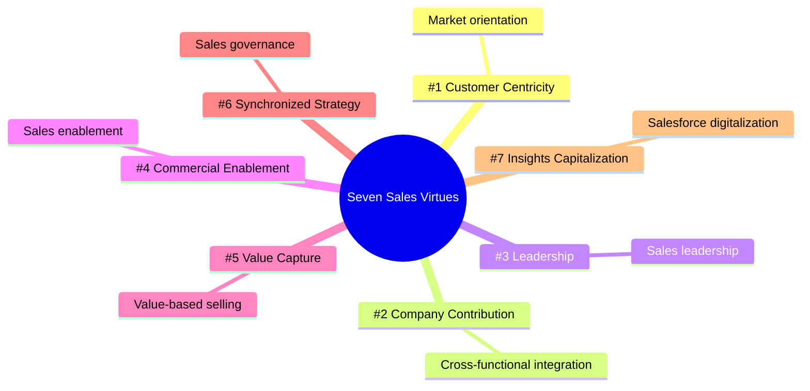

# The Seven Sales Virtues Framework (Diephuis & Skiver)

The **Seven Sales Virtues** is a comprehensive, research-based framework highlighting the core capability areas that high-performance sales organizations must develop. Derived from the FOSTER presentation (Diephuis, Skiver et al.) and taught by **Prof. Dr. Thomas Berger** (Slide 32), the model maps specific strategic virtues to established organizational constructs and academic literature.

---

## 📊 The Seven Sales Virtues Matrix

| Virtue | Construct | Strategic Objective & Focus | Key Academic References |
|---|---|---|---|
| **#1 - Strengthen customer centricity** | **Market orientation** | Developing a deep, shared understanding of customer needs and competitor capabilities across the firm. | *Morgan et al. (2009); Tajeddini et al. (2006); Javalgi et al. (2006)* |
| **#2 - Contribute company-wide** | **Cross-functional integration** | Breaking down silos between Sales, Marketing, R&D, and Production to align customer delivery and product features. | *Scherer & Biemans (2025); Liu et al. (2020); Malshe & Krush (2021)* |
| **#3 - Walk the talk** | **Sales leadership** | Fostering trust, guidance, and strategic alignment through supportive and effective sales management. | *Hautamäki & Heikinheimo (2025); Mullins & Agnihotri (2022)* |
| **#4 - Elevate Commercial Enablement** | **Sales enablement** | Equipping sales teams with the correct tools, materials, content, training, and technology to sell effectively. | *Lauzi et al. (2023); Mukhopadhyay et al. (2025); Friend et al. (2025)* |
| **#5 - Clarify and Capture Value** | **Value-based selling** | Shifting from feature-based pitching to value quantification, cost-benefit modeling, and TCO alignment. | *Mullins et al. (2020); Keränen et al. (2020)* |
| **#6 - Synchronize strategy** | **Sales governance** | Aligning sales compensation, territory design, quotas, and controls with the overarching corporate strategy. | *Iyer et al. (2025); Good et al. (2022); Samaraweera et al. (2023)* |
| **#7 - Capitalize on insights** | **Salesforce digitalization** | Utilizing CRMs, data analytics, and AI assistants to drive forecasting, pipeline management, and productivity. | *Zoltners et al. (2021); Guenzi & Nijssen (2020)* |

---

## 🎯 Strategic Context in Technical Sales

For a **Sales Engineer** or B2B sales organization, these virtues represent a roadmap:
1.  **Virtues #1 & #5 (Customer Centricity & Value Capture)**: Allow the salesperson to act as an active problem solver and build tailored financial models (such as [[Total_Cost_of_Ownership]] calculations).
2.  **Virtue #2 (Cross-Functional Integration)**: Ensures that custom technical requirements defined during the [[Technical_Expert_Sales_Process]] are accurately communicated to R&D and manufacturing.
3.  **Virtues #4 & #7 (Enablement & Digitalization)**: Are supported by modern sales tech cycles, such as those evaluated in the [[Gartner_Hype_Cycle_Sales_2024]].

---

## Fonti
*   *Diephuis, Skiver et al. "FOSTER-presentation at GSSI".*
*   *Sales Competences course slides (Slide 32) - Prof. Dr. Thomas Berger.*
*   *[[Slide_Sales_Competences_Thomas_Berger]]*
