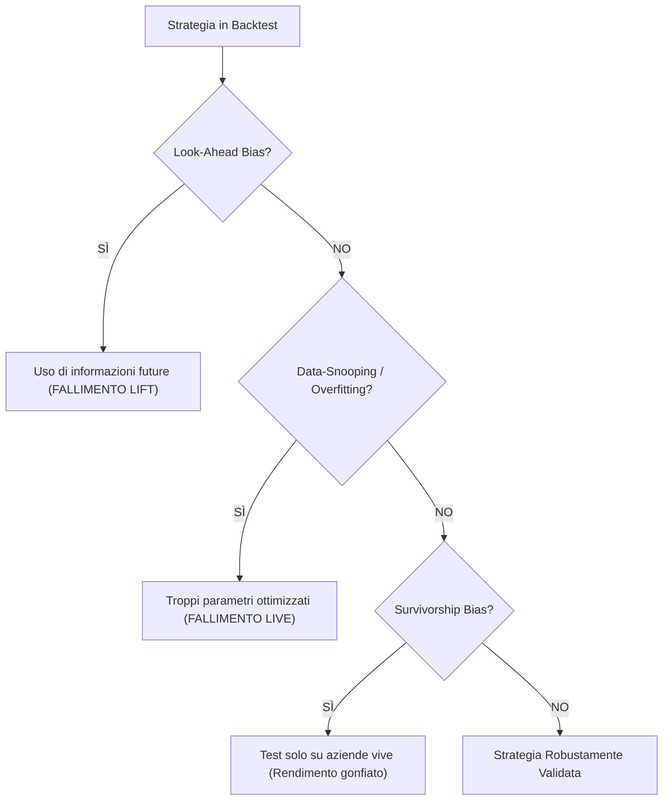

# 📈 Strategia di Lungo Termine e Trading Sistematico

Costruire un'attività di speculazione finanziaria a lungo termine richiede il passaggio dal trading discrezionale (basato sull'intuizione) ad un **sistema di trading quantitativo e strutturato**. Questa scheda di concetto sintetizza la teoria della finanza quantitativa applicata di **Robert Carver** (*Leveraged Trading* e *Systematic Trading*) ed **Ernest Chan** (*Quantitative Trading*), definendo un blueprint operativo per lo sviluppo e la gestione del rischio.

---

## 1. Il Modello Operativo di Robert Carver: Il "Starter System"

Nel suo libro *Leveraged Trading*, Robert Carver introduce il **Starter System**, un sistema a regole rigide progettato per essere scalabile, economico e protetto dai rischi della leva finanziaria.

### A. Regole d'Ingresso (The Trading Rules)
Il sistema base utilizza due tipi di regole per determinare la direzione della posizione:

1.  **Moving Average Crossover (MAV):** Il crossover a medie mobili esponenziali **16/64** (16 giorni per la media veloce, 64 giorni per la lenta).
    *   *Regnale Rialzista:* $EMA_{16} > EMA_{64} \implies$ **LONG**
    *   *Regnale Ribassista:* $EMA_{16} < EMA_{64} \implies$ **SHORT**
2.  **Breakout Rule (Rottura dei Canali):** Ingresso basato sul superamento del massimo o minimo degli ultimi $N$ giorni (es. breakout a 20 o 40 giorni).

### B. La Gestione del Rischio: Il Volatility Target (Target di Rischio)
Invece di rischiare una percentuale fissa del conto per trade (es. la regola classica del 2% che ignora la volatilità), Carver introduce il **Volatility Target**.

1.  **Definizione del Target di Rischio Annuo ($Risk_{annuo}$):** Lo standard professionale per un portafoglio conservativo è il **12%** di volatilità annua del capitale.
2.  **Calcolo del Target di Rischio Giornaliero ($Risk_{giorno}$):**
    $$Risk_{giorno} = \frac{Capital \times Risk_{annuo}}{\sqrt{256}}$$
    *Esempio:* Su un conto prop da $100.000 con un target del 12% annuo, il rischio giornaliero accettabile è:
    $$Risk_{giorno} = \frac{\$100.000 \times 0,12}{16} = \$750\text{ al giorno}$$
3.  **Calcolo della Volatilità Giornaliera dello Strumento ($\sigma_{daily}$):** Misurata tramite la Deviazione Standard o, in modo più robusto come nel modello `[[Gold_Speculation_Strategy]]`, tramite la **MAD** (Median Absolute Deviation):
    $$\sigma_{daily} = Price \cdot Volatility_{annual} \quad \text{o} \quad \sigma_{\text{robust}} = MAD \times 1.4826$$
4.  **Determinazione della Size Nominale (Nominal Position Size):**
    $$\text{Nominal Size} = \frac{Risk_{giorno}}{\sigma_{daily}}$$

### C. La Filosofia Avanzata: Trading Continuo senza Stop Loss
Carver sostiene una tesi rivoluzionaria per i retail trader ma standard nei grandi hedge fund quantitativi: **nei sistemi a trading continuo, lo Stop Loss non è necessario ed è inefficiente**.

*   **Il Principio della Size Dinamica:** Invece di avere una posizione binaria (tutto Long o tutto Flat con stop loss), il trader sistematico varia la dimensione della posizione in base alla forza del segnale (es. segnale debole = size ridotta al 20%; segnale forte = size al 100%).
*   **Perché lo stop loss distrugge valore?** Lo stop loss costringe a chiudere la posizione nel punto di massimo panico, pagando lo *spread* bid-ask e subendo lo *slippage* in momenti di illiquidità. Nel trading continuo, il segnale stesso inverte la posizione in modo controllato prima che si verifichi la rovina, a patto che la size iniziale rispetti il Volatility Target.
*   > [!IMPORTANT]
    > **Adattamento per le Prop Firm:** Sebbene teoricamente lo stop loss sia inefficiente nel lungo termine, i vincoli rigidi delle Prop Firm (Drawdown del 5% daily) impongono l'uso di uno **Stop Loss di Emergenza** (Hard Stop) posizionato a $2.5 \times \sigma_{daily}$ come "paracadute" contro cigni neri sistemici.

---

## 2. Il Rigore Metodologico di Ernest Chan: Evitare i Tranelli del Backtest

Ernest Chan, nel suo trattato *Quantitative Trading*, si concentra sulla validazione scientifica delle strategie, spiegando perché la maggior parte delle strategie con ottimi backtest fallisce miseramente nel trading reale.

### A. I 3 Bias Letali del Backtesting

1.  **Look-Ahead Bias (Bias del Senno di Poi):**
    *   Si verifica quando l'algoritmo di backtest utilizza (spesso implicitamente nel codice) informazioni che non erano disponibili al momento del trade.
    *   *Esempio:* Calcolare la media mobile del giorno corrente includendo il prezzo di chiusura prima che la giornata sia effettivamente terminata.
2.  **Data-Snooping / Overfitting (Sovraottimizzazione dei Parametri):**
    *   Si verifica quando si testano migliaia di combinazioni di parametri (es. testare tutte le combinazioni di medie mobili da 1 a 100) per trovare quella che ha reso di più in passato.
    *   *La regola di Chan:* Più parametri ottimizzi, più il tuo backtest descrive il "rumore storico" del mercato anziché l'edge statistico. Una strategia robusta deve funzionare bene su un ampio spettro di parametri (es. se la 16/64 funziona, deve funzionare dignitosamente anche la 15/60 o la 20/80).
3.  **Survivorship Bias (Bias di Sopravvivenza):**
    *   Si verifica quando si esegue il backtest solo sulle azioni attualmente quotate sul mercato, ignorando tutte le società che sono fallite o state delistate nel periodo di test. Questo gonfia artificialmente le performance storiche della strategia.

### B. La Stima dei Costi di Transazione Reali
Chan dimostra che lo spread bid-ask e le commissioni del broker sono i veri "killer" dei sistemi quantitativi. Una strategia con un elevato numero di trade giornalieri (scalping) necessita di un *Win Rate* eccezionalmente alto per coprire i costi di transazione, mentre strategie multi-day (come lo swing trading del modello AMSR) sono strutturalmente più resistenti.

---

## 3. Sintesi Operativa per il Trader Sistematico

Per combinare Carver e Chan in una strategia di lungo termine orientata al superamento delle Prop Firm:

1.  **Semplicità del Modello:** Prediligere strategie con pochissimi parametri (es. il Robust Z-Score basato su MAD e un filtro di trend lineare, vedi `[[Gold_Speculation_Strategy]]`).
2.  **Volatility Targeting Rigido:** Calcolare la dimensione dei lotti o contratti in base al target di rischio del conto funded, riducendola del 50% in presenza di regole di Trailing Drawdown (vedi `[[Guida_Selezione_Prop_Firm]]`).
3.  **Validazione Fuori Campione (Out-of-Sample Testing):** Testare sempre la strategia su dati storici che l'algoritmo non ha mai visto durante la fase di progettazione per verificare la reale capacità predittiva.

---

## Fonti
*   **Robert Carver** — *[[raw/input.md]]* (Chapters 4, 5, 9, 10 on Starter System, position sizing and continuous trading).
*   **Ernest P. Chan** — *[[c:\Users\jaafa\Downloads\llm_wiki-main\raw\input.md]]* (Chat metadata / Preface and Chapter 2 on Backtesting pitfalls and strategy identification).
*   **Marcos López de Prado** — *[[Advances in Financial Machine Learning (Marcos M. López de Prado) (z-library.sk, 1lib.sk, z-lib.sk).md]]* (Trattazione avanzata sul data-snooping e validazione out-of-sample).
