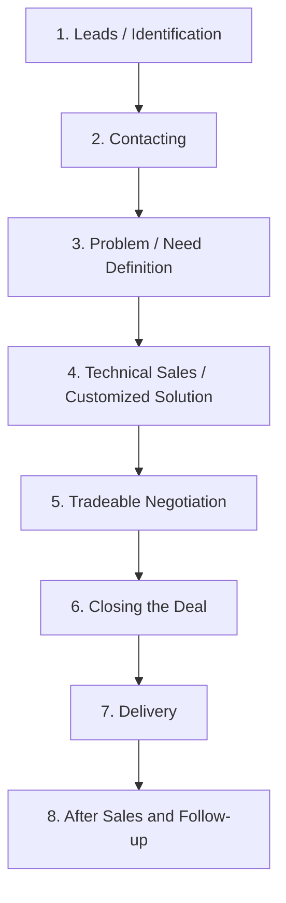

# Technical / Expert Sales Process

This note summarizes the **Technical/Expert Sales Process** based on the lectures of **Prof. Dr. Thomas Berger** (DHBW Lörrach) for the *Sales Competences* course at Università Politecnica delle Marche.

---

## 💡 Nature of the Expert Sales Process

According to **Holopainen T. et al. (2020)**, the expert sales process for complex technical products is defined by the following characteristics:

*   **Role of the Seller**: The salesperson acts as an **active problem solver**. Their primary job is to diagnose the customer's situation and translate customer needs into concrete benefits that the product, service, or solution can offer.
*   **Professional Alignment**: Both the seller and the customer are active professionals, and very often both are **engineers**. The conversation is technical, objective, and consultative.
*   **High Time Commitment**: The amount of time invested during the expert sales process is very high (long sales cycles, detailed evaluations).
*   **Low Marketing/Social Media Impact**: Because the products are highly complex, customized, and niche B2B systems, traditional marketing, social media, and transactional sales pitches have very low relevance.
*   **The Challenger Salesperson**: In challenging sales environments, the salesperson does not simply agree with the customer. Instead, they **challenge the views of the customer** to help them re-conceptualize their problems and discover better solutions.

---

## 🔄 The 8 Steps of the Expert Sales Process

The process is structured into eight logical stages:

### 1. Leads / Identification
Identifying potential B2B customers who have engineering or system needs that match the company's capabilities.

### 2. Contacting
Initiating professional contact with key technical stakeholders (members of the buying center).

### 3. Problem / Need Definition
Diagnosing the client's problem. This stage is collaborative and can include **joint development or construction** to co-create a specification list.

### 4. Technical Sales / Customized Solution Offer
Proposing the customized solution. The technical salesperson presents how the custom product/service solves the defined problems and calculates the business value (ROI).

### 5. Tradeable Negotiation
Negotiating terms. This is a "tradeable" negotiation, meaning both technical parameters and commercial terms (price, warranty, SLAs) can be adjusted to find a win-win configuration.

### 6. Closing the Deal
Finalizing and signing the commercial agreement.

### 7. Delivery
Fulfilling the order, which in technical sales often involves installation, integration, and technical testing.

### 8. After Sales and Follow-up
Maintaining relationships, providing ongoing technical support, and identifying opportunities for upselling or cross-selling.

---

## Fonti
*   *Sales Competences course slides (Slides 12 & 13) - Prof. Dr. Thomas Berger (DHBW Lörrach).*
*   *Holopainen T. et al. (2020) - Sales Competences Research.*
