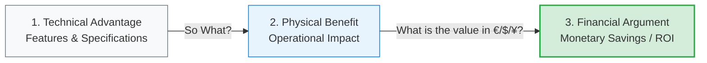

# Technical to Financial Value Conversion

In complex B2B sales, engineers and procurement departments speak different languages. While engineers focus on technical specifications, procurement and executives make decisions based on financial returns. The **Value Conversion Framework** (Jensen, 2013), taught by **Prof. Dr. Thomas Berger** (Slide 25), outlines the essential process of translating raw technical features into physical benefits, and finally into quantified financial arguments.

---

## 🔄 The Three-Step Translation Process

Successful value selling requires moving from left to right through these three stages:

1.  **Technical Advantage**: What the product *is* or *has* (features, engineering specifications, raw performance).
2.  **Physical Customer Benefit**: What the product *does* to improve the customer's operations (time saved, defect reduction, durability).
3.  **Financial Advantage Argument**: The *monetary value* of that operational improvement (monthly savings, payback period, labor cost reduction).

---

## 📊 Translation Matrix (Examples from Jensen 2013)

| # | Technical Advantage (What it is) | Physical Customer Benefit (What it does) | Financial Advantage Argument (Monetary Value / ROI) |
|---|---|---|---|
| **1** | *"This machine produces ten pieces per minute."* | *"With this machine, you save a lot of time. You can produce your products in half the time."* | *"With this machine, you'll save **€20,000 per month** compared to your old machine. It will have **paid for itself in just 15 months**."* |
| **2** | *"Our RFID tags now transmit on the UHF frequency."* | *"With these RFID tags, your first-time detection rate increases from 70 to 85 percent."* | *"You'll save **€2.80 per pallet** on manual inspection and rework, which is **€800,000 per year**."* |
| **3** | *"Our fertilizers are now coated."* | *"You now need to apply fertilizer less often because it doesn't wash away as quickly as your previous fertilizer."* | *"You'll save **€4,000 per month** in labor costs compared to your previous fertilizer."* |
| **4** | *"These abrasives now contain diamond particles."* | *"You need to replace the grinding wheels much less often because they last 200 percent longer."* | *"You'll save **€15,000 per grinding machine**, per year, when you use these abrasives."* |

---

## 💡 Best Practices in Value Conversion

*   **Avoid Technical Jargon Alone**: Leading a sales pitch with *"We transmit on the UHF frequency"* is ineffective unless it is linked to the €800,000 annual inspection savings.
*   **Establish Baseline Data**: To build a valid financial argument, the sales team must collaborate with the customer to understand their current operational costs (e.g., labor costs, setup times, waste rates).
*   **Structure Payback Arguments**: B2B buyers respond strongly to payback period arguments (e.g., *"paid for itself in 15 months"*), as it simplifies capital allocation decisions for executives.

---

## Fonti
*   *Jensen: "Financial benefit calculation as a basic competence in technical sales", Sales Management Review, Issue 9/10, 2013, pp. 38-47.*
*   *Sales Competences course slides (Slide 25) - Prof. Dr. Thomas Berger.*
*   *[[Slide_Sales_Competences_Thomas_Berger]]*
