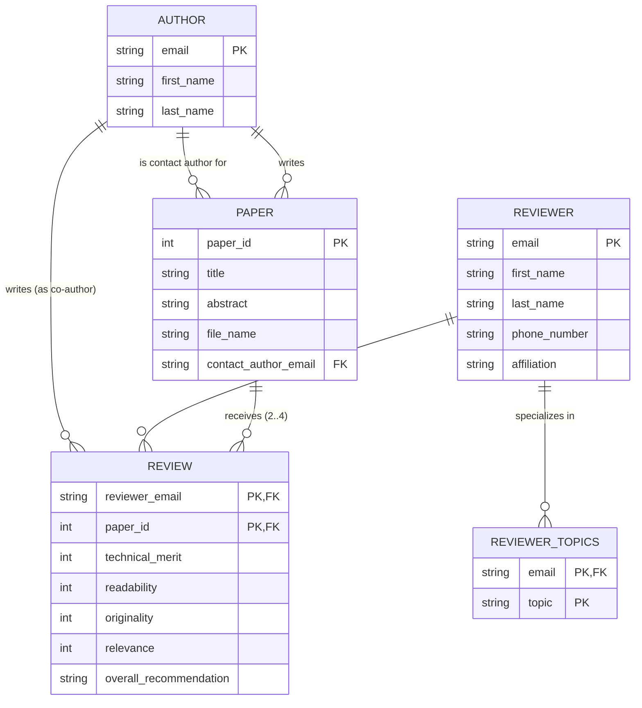

# 📝 Esercizio 1 — Schema ER Conference Review Database

Questo documento contiene la risoluzione e l'analisi dettagliata dell'**Esercizio 1** mostrato nel foglio d'esame per il database `CONFERENCE_REVIEW`.

---

## 1. Analisi dei Requisiti e Progettazione Concettuale

Dall'analisi del testo, identifichiamo le seguenti entità, attributi e relazioni:

### Entità e Attributi
1. **AUTHOR (Autore)**
   - `email` (Identificatore Univoco / Chiave Primaria)
   - `first_name` (Nome)
   - `last_name` (Cognome)

2. **PAPER (Articolo/Paper)**
   - `paper_id` (Identificatore Univoco generato dal sistema / Chiave Primaria)
   - `title` (Titolo)
   - `abstract` (Sommario)
   - `file_name` (Nome del file elettronico)

3. **REVIEWER (Revisore)**
   - `email` (Identificatore Univoco / Chiave Primaria)
   - `first_name` (Nome)
   - `last_name` (Cognome)
   - `phone_number` (Numero di telefono)
   - `affiliation` (Affiliazione, es. Università o Ente)
   - `topics_of_interest` (Argomenti di interesse - **Attributo Multivalore**, poiché un revisore può avere più argomenti di interesse).

### Relazioni
1. **WRITES (Scrive)** — Associazione tra **AUTHOR** e **PAPER**
   - **Tipo**: Molti-a-Molti ($M:N$) $\rightarrow$ Un autore può scrivere più paper; un paper può avere più autori.
   - **Partecipazione**:
     - `PAPER` ha partecipazione obbligatoria (minimo 1 autore).
     - `AUTHOR` ha partecipazione facoltativa (può esistere un autore nel sistema che non ha ancora sottomesso articoli, o obbligatoria se inserito solo al momento della sottomissione).

2. **CONTACT_AUTHOR (Autore di Contatto)** — Associazione tra **AUTHOR** e **PAPER**
   - Il testo specifica: *"A paper may have multiple authors, but one is designated as the 'contact author'"*.
   - **Tipo**: Uno-a-Molti ($1:N$) $\rightarrow$ Un autore può essere l'autore di contatto per più paper; un paper ha esattamente **un** autore di contatto.
   - **Vincolo**: L'autore di contatto deve essere uno degli autori che hanno scritto il paper (vincolo di integrità referenziale/semantica).

3. **REVIEWS (Revisiona)** — Associazione tra **REVIEWER** e **PAPER**
   - **Tipo**: Molti-a-Molti ($M:N$) $\rightarrow$ Un revisore revisiona più paper; un paper riceve valutazioni da più revisori.
   - **Vincolo di Cardinalità**: Ciascun paper deve essere assegnato a **minimo 2 e massimo 4 revisori** (cardinalità per `PAPER` in `REVIEWS`: $2 \dots 4$).
   - **Attributi della Relazione (Attributi di Associazione)**:
     - `technical_merit` (Merito tecnico, voto 1-10)
     - `readability` (Leggibilità, voto 1-10)
     - `originality` (Originalità, voto 1-10)
     - `relevance` (Pertinenza alla conferenza, voto 1-10)
     - `overall_recommendation` (Raccomandazione globale, es. Accetta/Rifiuta)

---

## 2. Diagramma ER — Notazione Crow's Foot (Standard Moderno)

In questa rappresentazione, la relazione molti-a-molti con attributi `REVIEWS` viene modellata tramite un'entità associativa **REVIEW** per mostrare chiaramente gli attributi del voto. Inoltre l'attributo multivalore `topics_of_interest` viene modellato come tabella separata.



---

## 3. Diagramma ER — Notazione Chen (Libro Elmasri-Navathe)

Questa è la notazione classica utilizzata nel libro di testo (con rettangoli per le entità, rombi per le relazioni e ovali per gli attributi). Gli attributi sottolineati sono chiavi primarie, mentre l'ovale a doppio bordo rappresenta l'attributo multivalore.

```mermaid
graph TD
    %% Entità
    Author[("Entità: AUTHOR")]
    Paper[("Entità: PAPER")]
    Reviewer[("Entità: REVIEWER")]

    %% Relazioni
    Writes{{"Relazione: WRITES<br/>(M:N)"}}
    Contact{{"Relazione: CONTACT_AUTHOR<br/>(1:N)"}}
    Reviews{{"Relazione: REVIEWS<br/>(M:N)"}}

    %% Attributi Author
    A_Email("(<u>email</u>)") --- Author
    A_FN("(first_name)") --- Author
    A_LN("(last_name)") --- Author

    %% Attributi Paper
    P_ID("(<u>paper_id</u>)") --- Paper
    P_Title("(title)") --- Paper
    P_Abs("(abstract)") --- Paper
    P_File("(file_name)") --- Paper

    %% Attributi Reviewer
    R_Email("(<u>email</u>)") --- Reviewer
    R_FN("(first_name)") --- Reviewer
    R_LN("(last_name)") --- Reviewer
    R_Phone("(phone_number)") --- Reviewer
    R_Aff("(affiliation)") --- Reviewer
    R_Topics("(«multivalore»<br/>topics_of_interest)") --- Reviewer

    %% Collegamenti Entità-Relazioni con cardinalità
    Author ===| M | Writes
    Writes ===| N | Paper
    
    Author ===| 1 | Contact
    Contact ===| N | Paper

    Reviewer ===| M | Reviews
    Paper ===| "2..4" | Reviews

    %% Attributi della relazione REVIEWS
    Rev_Tech("(technical_merit)") --- Reviews
    Rev_Read("(readability)") --- Reviews
    Rev_Orig("(originality)") --- Reviews
    Rev_Rel("(relevance)") --- Reviews
    Rev_Rec("(overall_recommendation)") --- Reviews

    %% Stile Grafico
    style Author fill:#161b22,stroke:#58a6ff,stroke-width:2px;
    style Paper fill:#161b22,stroke:#58a6ff,stroke-width:2px;
    style Reviewer fill:#161b22,stroke:#58a6ff,stroke-width:2px;
    style Writes fill:#0d1117,stroke:#d2a8ff,stroke-width:2px;
    style Contact fill:#0d1117,stroke:#d2a8ff,stroke-width:2px;
    style Reviews fill:#0d1117,stroke:#d2a8ff,stroke-width:2px;
    classDef default color:#c9d1d9;
```

---

## 4. Schema Relazionale (Passaggio al Modello Logico)

Per mappare questo schema nel modello relazionale (tabelle SQL), creiamo le seguenti tabelle:

1.  **AUTHOR** (<u>email</u>, first_name, last_name)
2.  **PAPER** (<u>paper_id</u>, title, abstract, file_name, *contact_author_email*)
    - *contact_author_email* è una Foreign Key che punta a `AUTHOR(email)`. NOT NULL.
3.  **PAPER_AUTHOR** (<u>*paper_id*</u>, <u>*author_email*</u>)
    - Tabella di giunzione per mappare la relazione $M:N$ **WRITES**.
    - Entrambi i campi sono Foreign Key che puntano rispettivamente a `PAPER(paper_id)` e `AUTHOR(email)`.
4.  **REVIEWER** (<u>email</u>, first_name, last_name, phone_number, affiliation)
5.  **REVIEWER_TOPIC** (<u>*reviewer_email*</u>, <u>topic</u>)
    - Gestisce l'attributo multivalore `topics_of_interest`.
    - *reviewer_email* è Foreign Key verso `REVIEWER(email)`.
6.  **REVIEW** (<u>*reviewer_email*</u>, <u>*paper_id*</u>, technical_merit, readability, originality, relevance, overall_recommendation)
    - *reviewer_email* è Foreign Key verso `REVIEWER(email)`.
    - *paper_id* è Foreign Key verso `PAPER(paper_id)`.
    - I voti hanno un vincolo `CHECK (voto BETWEEN 1 AND 10)`.

### Vincolo critico: Assegnamento 2..4 revisori
Il vincolo per cui ogni paper deve avere **tra 2 e 4 revisori** non può essere verificato tramite chiavi o vincoli `CHECK` standard su singola riga. A livello di Database si può implementare tramite:
- Un **Trigger** (su INSERT/UPDATE/DELETE nella tabella `REVIEW` che conta le righe per lo specifico `paper_id` e impedisce la transazione se si viola il limite).
- Oppure a livello applicativo (nella Business Logic prima di confermare le assegnazioni).

---

## Fonti
*   *Elmasri & Navathe, Fundamentals of Database Systems*, Capitolo 3 (Modello ER) e Capitolo 4 (Modello EER / Specializzazione e Generalizzazione).
*   Esercizio 1 tratto da materiale didattico UNIVPM.
