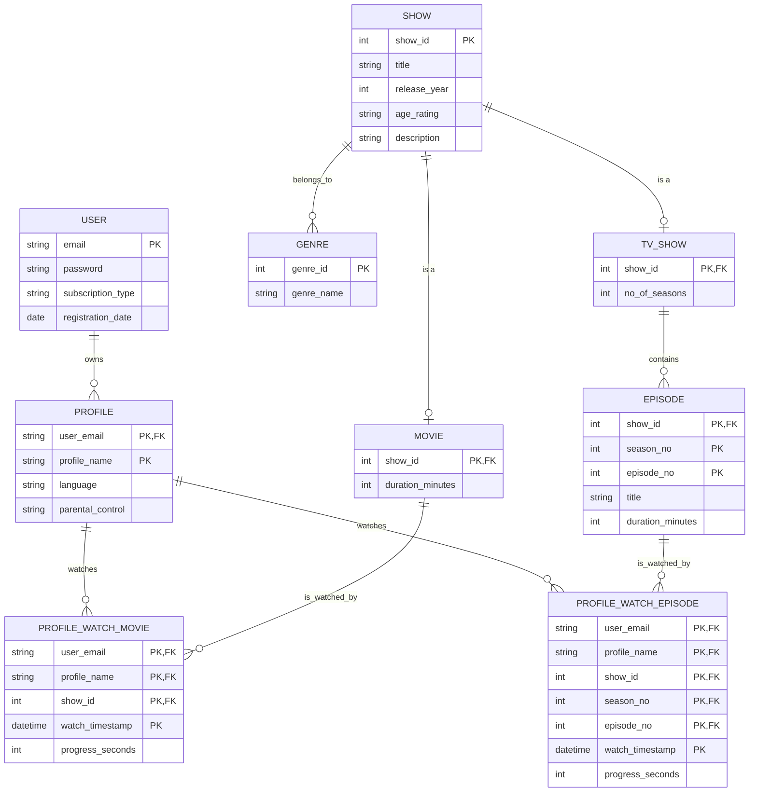

# 📺 Esercizio 2 — Schema ER Netflix

Questo documento contiene la progettazione concettuale e logica completa per un database stile **Netflix**, risolvendo l'**Esercizio 2** proposto nel foglio d'esame.

---

## 1. Definizione dei Requisiti dei Dati (Assunzioni)

Per progettare il database di una piattaforma di streaming tipo Netflix, stabiliamo i seguenti requisiti:
1.  **Utenti e Abbonamenti**:
    *   Un `USER` (Account principale) è identificato da una `email` univoca. Registriamo una password, la data di registrazione e il tipo di abbonamento attivo.
2.  **Profili Multipli (Entità Debole)**:
    *   Ogni account principale può creare fino a 5 profili distinti (es. "Mamma", "Papà", "Bambini").
    *   Un `PROFILE` non può esistere senza un account `USER`. È identificato dal nome del profilo (`profile_name`) in combinazione con l'email dell'account. Registriamo la lingua di preferenza e il livello di parental control.
3.  **Catalogo dei Contenuti (Ereditarietà)**:
    *   I contenuti multimediali (`SHOW`) sono identificati da un `show_id` univoco. Registriamo titolo, anno di uscita, descrizione e classificazione d'età (rating).
    *   Un contenuto può essere di due tipi (specializzazione disgiunta):
        *   `MOVIE` (Film): Caratterizzato dalla durata in minuti.
        *   `TV_SHOW` (Serie TV): Caratterizzato dal numero di stagioni.
4.  **Episodi delle Serie (Entità Debole)**:
    *   Una serie TV è composta da episodi. Un `EPISODE` è un'entità debole che dipende da `TV_SHOW`. È identificato dal numero di stagione (`season_no`) e dal numero di episodio (`episode_no`) in combinazione con il `show_id` della serie. Registriamo il titolo dell'episodio e la durata.
5.  **Generi**:
    *   I contenuti appartengono a uno o più generi (es. "Fantascienza", "Commedia"). Un `GENRE` è identificato da un `genre_id` e ha un nome.
6.  **Interazioni (Cronologia e Valutazioni)**:
    *   Un profilo può guardare film o singoli episodi. Questa cronologia (`WATCH_HISTORY`) registra la data di visione e i secondi di riproduzione accumulati (per riprendere la visione).
    *   Un profilo può valutare un contenuto (`RATES`) con un voto (es. pollice su/giù o da 1 a 5 stelle) e la data della valutazione.

---

## 2. Diagramma ER — Notazione Crow's Foot (Standard Moderno)

---

## 3. Diagramma ER — Notazione Chen (Libro Elmasri-Navathe)

Per motivi accademici, ecco la rappresentazione classica. Le entità deboli sono indicate con doppio rettangolo, le relazioni identificanti con doppio rombo, e gli attributi parziali (discriminanti) delle entità deboli con linea tratteggiata.

```mermaid
graph TD
    %% Entità Regolari
    User["Entità: USER"]
    Show["Entità: SHOW"]
    Genre{{"Relazione: HAS_GENRE<br/>(M:N)"}}
    GenreEnt["Entità: GENRE"]

    %% Entità Deboli e Relazioni Identificanti
    ProfileOwns{{"Relazione Identificante:<br/>OWNS (1:N)"}}
    Profile[["Entità Debole: PROFILE"]]
    
    EpisodeContains{{"Relazione Identificante:<br/>CONTAINS (1:N)"}}
    Episode[["Entità Debole: EPISODE"]]

    %% Specializzazione
    SpecCircle(("d"))
    Movie["Sottoclasse: MOVIE"]
    TvShow["Sottoclasse: TV_SHOW"]

    %% Relazioni di Interazione
    WatchMovie{{"Relazione: WATCH_MOVIE<br/>(M:N)"}}
    WatchEpisode{{"Relazione: WATCH_EPISODE<br/>(M:N)"}}

    %% Collegamento Utente - Profilo
    User ===| 1 | ProfileOwns
    ProfileOwns ===| N | Profile

    %% Collegamento Catalogo - Generi
    Show ===| M | Genre
    Genre ===| N | GenreEnt

    %% Collegamento Specializzazione
    Show === SpecCircle
    SpecCircle --- Movie
    SpecCircle --- TvShow

    %% Collegamento Serie TV - Episodio
    TvShow ===| 1 | EpisodeContains
    EpisodeContains ===| N | Episode

    %% Collegamenti Interazioni dei Profili
    Profile ===| M | WatchMovie
    Movie ===| N | WatchMovie

    Profile ===| M | WatchEpisode
    Episode ===| N | WatchEpisode

    %% Attributi Chiave e Parziali
    U_Email("(<u>email</u>)") --- User
    P_Name("(<i>profile_name</i>)") --- Profile
    S_ID("(<u>show_id</u>)") --- Show
    E_No("(<i>episode_no</i>)") --- Episode
    E_Seas("(<i>season_no</i>)") --- Episode

    %% Stili
    style User fill:#161b22,stroke:#58a6ff,stroke-width:2px;
    style Show fill:#161b22,stroke:#58a6ff,stroke-width:2px;
    style GenreEnt fill:#161b22,stroke:#58a6ff,stroke-width:2px;
    style Profile fill:#161b22,stroke:#58a6ff,stroke-width:3px;
    style Episode fill:#161b22,stroke:#58a6ff,stroke-width:3px;
    style Movie fill:#0d1117,stroke:#ff7b72,stroke-width:2px;
    style TvShow fill:#0d1117,stroke:#ff7b72,stroke-width:2px;
    
    style ProfileOwns fill:#0d1117,stroke:#d2a8ff,stroke-width:3px;
    style EpisodeContains fill:#0d1117,stroke:#d2a8ff,stroke-width:3px;
    style WatchMovie fill:#0d1117,stroke:#d2a8ff,stroke-width:2px;
    style WatchEpisode fill:#0d1117,stroke:#d2a8ff,stroke-width:2px;
    classDef default color:#c9d1d9;
```

---

## 4. Schema Relazionale (Passaggio al Modello Logico)

Ecco le tabelle derivanti dallo schema:

1.  **USER** (<u>email</u>, password, subscription_type, registration_date)
2.  **PROFILE** (<u>*user_email*</u>, <u>profile_name</u>, language, parental_control)
    *   *`user_email` è parte della PK e FK verso `USER(email)` con `ON DELETE CASCADE`.*
3.  **SHOW** (<u>show_id</u>, title, release_year, age_rating, description)
4.  **MOVIE** (<u>*show_id*</u>, duration_minutes)
    *   *`show_id` è PK e FK verso `SHOW(show_id)`.*
5.  **TV_SHOW** (<u>*show_id*</u>, no_of_seasons)
    *   *`show_id` è PK e FK verso `SHOW(show_id)`.*
6.  **EPISODE** (<u>*show_id*</u>, <u>season_no</u>, <u>episode_no</u>, title, duration_minutes)
    *   *`show_id` è parte della PK e FK verso `TV_SHOW(show_id)`.*
7.  **GENRE** (<u>genre_id</u>, genre_name)
8.  **SHOW_GENRE** (<u>*show_id*</u>, <u>*genre_id*</u>)
    *   *Tabella molti-a-molti tra `SHOW` e `GENRE`.*
9.  **WATCH_MOVIE_HISTORY** (<u>*user_email*</u>, <u>*profile_name*</u>, <u>*show_id*</u>, <u>watch_timestamp</u>, progress_seconds)
    *   *`(user_email, profile_name)` è FK composta verso `PROFILE`.*
    *   *`show_id` è FK verso `MOVIE`.*
10. **WATCH_EPISODE_HISTORY** (<u>*user_email*</u>, <u>*profile_name*</u>, <u>*show_id*</u>, <u>*season_no*</u>, <u>*episode_no*</u>, <u>watch_timestamp</u>, progress_seconds)
    *   *`(user_email, profile_name)` è FK composta verso `PROFILE`.*
    *   *`(show_id, season_no, episode_no)` è FK composta verso `EPISODE`.*

---

## Fonti
*   *Elmasri & Navathe, Fundamentals of Database Systems*, Capitolo 3 (Modelli deboli ed ereditarietà) e Capitolo 9 (Mapping relazionale).
*   Esercizio 2 da traccia d'esame (Netflix).
